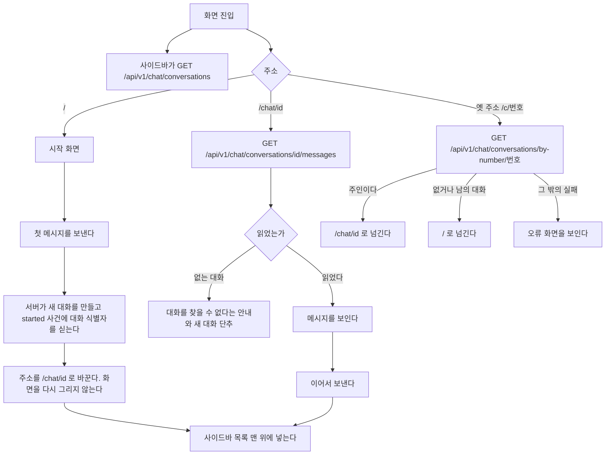

# 화면 틀과 목록

대화 화면을 감싸는 틀을 갖는다.
대화의 주소와 이력 읽기, 사이드바의 대화 목록, 화면 틀과 단축키, 기다리는 동안 보이는 것, 밝기 모드가 여기 있다.

## 대화 이력

브라우저를 새로 고쳐도 이어서 말할 수 있어야 한다.
대화와 메시지는 데이터베이스에 남아 있으므로 화면이 그것을 읽는다.

**대화마다 주소가 있다.** `/chat/{대화 식별자}` 다.
대화 식별자는 대화를 만들 때 정하는 UUID 다. 대화 표의 번호는 주소에 나오지 않는다.
`/` 는 새 대화를 시작하는 화면이고 지난 대화를 저절로 열지 않는다.
주소를 즐겨찾기하거나 다른 탭에 열 수 있게 하기 위해서다.



첫 메시지를 보내고 주소를 바꿀 때 화면을 다시 그리지 않는다.
경로를 옮기면 대화 화면이 새로 만들어져 흘러오던 답을 잃는다.
`window.history.replaceState` 로 주소만 바꾼다.

**주소만 바꿨으므로 그 뒤 「새 대화」 를 눌러도 화면이 새로 만들어지지 않을 수 있다.**
그래서 대화 화면은 주소가 `/` 인데 대화 식별자를 들고 있으면 스스로 상태를 비운다.
`started` 가 오기 전에 다른 대화로 옮겼으면 늦게 온 `started` 로 주소를 바꾸지 않는다.

**대화 식별자는 두 자리에서 생긴다.** 첫 메시지의 `started` 와, 새 대화에서 첫 사진을 올리기 전에 만드는 빈 대화다.
빈 대화의 규칙은 [`backend/attachment.md`](../backend/attachment.md) 의 「경로」 절이 갖는다.
두 자리 모두 식별자를 받는 즉시 주소를 `/chat/{id}` 로 바꾼다.
그래서 상태를 비우는 것은 주소가 `/` 로 **바뀌었을 때**나 「새 대화」 를 눌렀을 때뿐이다.
주소가 `/` 인 채 식별자를 들고 있는 것만 보고 비우면, 사진을 올리는 순간 방금 만든 대화가 지워진다.

### 갈리는 지점

| 상황 | 화면 |
| --- | --- |
| 대화가 하나도 없다 | 사이드바 목록 자리에 아직 대화가 없다는 한 줄. 시작 화면은 그대로 쓴다 |
| 메시지를 읽지 못했다 | 그 대화만 오류를 보이고 목록은 남긴다 |
| 남의 대화나 지운 대화의 주소다 | 없는 것과 같은 오류다. 대화를 찾을 수 없다는 안내와 새 대화 단추를 보인다 |
| 옛 주소 `/c/{번호}` 로 들어왔다 | 주인이면 `/chat/{id}` 로 넘긴다. 없거나 남의 대화면 `/` 로 넘긴다. 둘을 가리지 않는다 |
| 옛 주소의 번호 조회가 없는 대화가 아닌 까닭으로 실패했다 | `/` 로 넘기지 않고 오류 화면을 보인다. 서버 오류를 첫 화면으로 덮지 않는다 |
| 대화 식별자가 UUID 모양이 아니다 | `/` 로 넘긴다 |
| 대화 식별자에 대문자가 섞였다 | 소문자 주소 `/chat/{id}` 로 넘긴다. 사이드바가 주소를 소문자 식별자와 그대로 비교한다 |
| 보내는 중이다 | 보내기 단추 옆에 중지 단추가 나온다. 보내기는 그대로 눌린다. [`backend/turn-control.md`](../backend/turn-control.md) 의 「응답 중에 보낼 때」 절이 갖는다 |
| `started` 전에 실패했다 | 쓴 문장을 입력창에 되돌려 다시 보낼 수 있게 한다. 서버에 아무것도 남지 않았다 |
| `started` 뒤에 실패했다 | 사용자 메시지는 서버에 남았다. 입력창에 되돌리지 않고 그 메시지 아래에 오류와 「다시 시도」 를 보인다 |
| 앞의 답이 끝나기 전에 또 보냈다 | 두 번째 글은 대기 메시지로 쌓인다. 다른 탭에서 보내도 같다. [`backend/turn-control.md`](../backend/turn-control.md) 의 「응답 중에 보낼 때」 절이 갖는다 |
| 보내는 중에 다른 대화를 고른다 | 고를 수 있다. 앞 실행은 서버에서 계속 돌고 끝나면 저장된다 |

실패한 요청의 문장을 되돌리는 것이 중요하다.
보내는 순간 입력창을 비우므로, 되돌리지 않으면 사용자가 쓴 문장이 사라진다.
**다만 `started` 가 온 뒤라면 되돌리지 않는다.** 서버에 이미 저장된 질문이라, 되돌려 다시 보내면 같은 질문이 둘 남는다.
「다시 시도」 는 다시 생성과 같은 경로다. [`chat.md`](chat.md) 의 「다시 생성」 절이 갖는다.

## 대화 목록

사이드바의 목록은 최근에 고친 순서이고 날짜로 묶는다.

| 묶음 | 기준 |
| --- | --- |
| 오늘 | `updatedAt` 이 브라우저 시간으로 오늘 |
| 어제 | 어제 |
| 지난 7일 | 그보다 앞이고 7일 안 |
| 지난 30일 | 그보다 앞이고 30일 안 |
| 그 이전 | 나머지 |

제목이 빈 대화는 「새 대화」 로 보인다. 사진만 올리고 아직 보내지 않은 대화가 그렇다.

목록은 한 쪽(30개)을 읽고, 끝에 닿으면 다음 쪽을 읽는다.

검색은 제목을 브라우저에서 거른다. 아직 읽지 않은 쪽이 있으면 검색어를 쓰는 동안 남은 쪽을 쪽당 100개씩 모두 읽어 온 뒤 거른다.
빈 제목은 「새 대화」 로 보고 거른다. 메시지 본문은 찾지 않는다.

한 줄에 마우스를 올리면 메뉴 단추가 보인다. 좁은 화면에서는 늘 보인다. 메뉴는 이름 바꾸기와 지우기다.

```mermaid
flowchart TD
    A[이름 바꾸기] --> B[그 줄이 입력칸이 된다]
    B --> C{Enter 또는 바깥을 누름}
    C -- 빈 이름 --> D[원래 이름으로 되돌린다]
    C -- 이름 있음 --> E[PATCH /api/v1/chat/conversations/id]
    E -- 실패 --> D2[원래 이름으로 되돌리고 오류를 알린다]
    B -- Esc --> D
    F[지우기] --> G[확인 창]
    G -- 취소 --> H[아무것도 하지 않는다]
    G -- 지운다 --> I[DELETE /api/v1/chat/conversations/id]
    I -- 성공 --> J{지금 열린 대화인가}
    J -- 그렇다 --> K[/ 로 간다]
    J -- 아니다 --> L[목록에서 뺀다]
    I -- 실패 --> M[목록을 그대로 두고 오류를 알린다]
```

돌고 있는 대화도 지울 수 있다. 실행은 서버에서 끝까지 돌고 기록된다.
지운 대화에는 더 보낼 수 없다. 보내면 없는 대화와 같은 오류다.

## 화면 틀

ChatGPT 의 배치를 따른다. 위쪽 가로 메뉴를 두지 않고 왼쪽 사이드바 하나에 모은다.
화면 높이를 채우고 그 안에서 메시지 영역만 스크롤한다. 입력창은 늘 아래에 붙어 있다.

```
┌─ 사이드바 ─┬─ 대화 ─────────────────────┬─ 작업 과정 패널 ─┐
│ ◧  ✎ 새 대화│ 에이전트 이름               │ (열었을 때만)     │
│ 🔍 검색     ├────────────────────────────┤                  │
│ 오늘        │ 메시지                      │ 실행 나무         │
│  대화 A     │                            │                  │
│ 지난 7일    │                            │                  │
│  대화 B     ├────────────────────────────┤                  │
│─────────── │ 입력창                 ■ / ↑│                  │
│ 에이전트    │                            │                  │
│ 연결        │                            │                  │
│ 기억 (2)    │                            │                  │
│ 사용량      │                            │                  │
│ 사용자 관리 │                            │                  │
│ 이름    ☾  │                            │                  │
└────────────┴────────────────────────────┴──────────────────┘
```

사이드바는 대화 화면만이 아니라 모든 화면에 있다. 로그인 화면에만 없다.
「사용자 관리」 는 `ADMIN` 에게만 보인다.

| 너비 | 사이드바 | 작업 과정 패널 |
| --- | --- | --- |
| `lg` 이상 | 왼쪽에 늘 보인다. 접을 수 있다 | 대화 오른쪽에 붙는다 |
| `md` 이상 `lg` 미만 | 왼쪽에 늘 보인다. 접을 수 있다 | 대화 위에 겹친다 |
| `md` 미만 | 서랍. 위쪽 막대의 단추로 열고 대화를 고르면 닫힌다 | 화면 전체를 덮는다 |

접은 상태는 그 브라우저에 남긴다.
좁은 화면의 위쪽 막대에는 서랍 단추와 에이전트 이름과 새 대화 단추만 둔다.

서랍은 누른 곳으로 옮겨진 뒤에 닫힌다.
옮기는 동안에는 열어 두어 누른 줄의 회전 표시와 「옮기는 중」 안내가 보이게 한다.
지금 있는 화면을 다시 누르면 옮길 것이 없으므로 곧바로 닫는다.

단축키는 새 대화, 사이드바 접기와 펴기, 대화 검색칸으로 가기 셋이다. 키 조합은 `web/src/components/shell/use-shortcuts.ts` 가 갖는다.
`Esc` 는 아래 차례로 하나만 한다.

**`Esc` 는 한 곳에서만 해석한다.** 대화 화면의 처리기 하나가 아래 차례로 보고 처음 맞는 하나만 한다.

1. 한글을 조합하는 중이면 아무것도 하지 않는다
2. 이름 입력칸, 확인 창, 서랍, `@` 목록처럼 더 안쪽의 것이 이미 처리했으면 아무것도 하지 않는다.
   그것들은 `Esc` 를 처리하면 전파를 막는다.
   Radix 부품이 `Esc` 로 닫으면 기본 동작이 막혀 대화 화면의 처리기가 건너뛴다. 막지 않는 부품이면 `onEscapeKeyDown` 에서 막는다.
   「중지」 의 풀이는 예외다. 풀이가 열려 있으면 `Esc` 가 풀이를 닫고 3번으로 넘어간다.
   마우스를 올려 둔 채 누른 `Esc` 가 풀이만 닫고 답을 멈추지 않으면 사용자는 두 번 눌러야 한다
3. 작업 과정 패널이 열려 있으면 닫는다
4. 답을 만드는 중이면 중지한다

이름 바꾸기를 `Esc` 로 취소했는데 돌던 답까지 멈추면 안 된다.

**입력창은 사용자가 대화를 바꿀 때만 새로 만든다.**
입력창이 올린 사진을 갖고 있고, 없어질 때 보내지 않은 사진을 서버에서 지운다.
대화 식별자가 생겼다고 새로 만들면 방금 올린 사진이 사라진다.
배치를 옮길 때도 같은 입력창 하나를 그대로 두고 자리만 바꾼다. 새 대화 화면의 가운데에서 아래로 내려갈 때가 그렇다.

### 새 메시지를 따라간다

메시지가 늘면 아래로 따라 내려간다.
다만 사용자가 위로 올려 지난 대화를 읽고 있으면 따라가지 않는다.
읽던 자리가 밀려나기 때문이다. 대신 `새 메시지` 단추를 띄워 누르면 내려간다.

## 기다리는 동안 보이는 것

기다림의 종류마다 다른 것을 보인다. 같은 회전 표시를 돌리지 않는다.

| 기다리는 것 | 보이는 것 |
| --- | --- |
| 대화 목록을 처음 읽는다 | 목록 자리에 뼈대 세 줄 |
| 고른 대화의 메시지를 읽는다 | 메시지 자리에 뼈대 두 줄 |
| 첫 사건을 기다린다 | 비서 이름 아래 답이 들어올 자리에 점 세 개가 차례로 밝아진다 |
| 도구나 하위 에이전트가 돈다 | 같은 자리의 작업 과정 블록이 지금 도는 것 한 줄과 흐른 시간을 보인다 |
| 답이 흘러나온다 | 글자가 그대로 쌓인다. 작업 과정 블록은 접힌 채 답 위에 남는다 |
| 다른 화면으로 옮긴다 | 누르는 즉시 그 화면 모양의 뼈대가 본문 자리를 채운다. 사이드바의 누른 줄 끝에 작은 회전 표시가 붙는다. 들어오는 본문은 200ms 동안 8px 오르며 나타난다. 대화 화면끼리 오갈 때는 움직이지 않는다 |
| 단추로 요청을 보냈다 | 그 단추 안에 회전 표시와 「저장 중」 처럼 지금 하는 일을 적는다. 단추 폭은 그대로다 |

뼈대는 실제 내용과 같은 높이로 둔다.
높이가 다르면 내용이 도착할 때 화면이 튄다.

**기다림 점, 작업 과정 블록, 답 본문은 같은 줄의 같은 자리에 차례로 들어온다.**
비서 얼굴과 이름이 먼저 자리를 잡고, 그 아래 칸의 내용만 바뀐다. 기다림 줄이 사라지고 답 줄이 새로 생기면 높이가 튄다.
움직임의 길이와 줄인 움직임 설정은 [ADR-051](../adr/ADR-051-화면-색은-새벽-보라로-바꾸고-강조-색은-누를-것과-고른-것과-초점에만-쓴다.md) 이 정한다.

**화면을 옮길 때 이전 화면을 그대로 두지 않는다.**
화면마다 서버가 데이터를 다 읽은 뒤에 그리므로, 뼈대가 없으면 읽는 동안 이전 화면이 멈춘 채 남는다.
그러면 누른 것이 먹혔는지 알 수 없다. 그래서 서버가 데이터를 읽는 화면 경로에 `loading.tsx` 를 둔다.
사이드바의 표시는 Next 의 `useLinkStatus` 가 그 링크의 이동이 끝나지 않았다고 알려 주는 동안만 보인다.

**요청을 보내는 단추를 흐리게만 하지 않는다.**
흐린 단추는 「지금 보내는 중」 과 「지금은 누를 수 없음」 을 가리지 못한다.
보내는 동안에는 회전 표시와 지금 하는 일을 보이고 `aria-busy` 를 켠다. 두 번 누르지 못하게 잠그는 것은 그대로다.

답이 흘러나오는 동안에는 회전 표시를 따로 두지 않는다.
글자가 늘어나는 것 자체가 진행이고, 그 옆에 회전 표시를 함께 두면 둘 중 무엇을 봐야 할지 모른다.

흐름이 2분을 넘기면 한 번만 알린다.
이 화면을 떠나도 실행은 계속 돌고, 다시 열면 저장된 답이 보인다는 것이다.

## 밝기 모드

밝음과 어두움과 시스템 셋 중에서 고른다. 고른 값은 그 브라우저에 남는다.
아무것도 고르지 않았으면 시스템 설정을 따른다.

첫 화면이 밝게 그려졌다가 어둡게 바뀌는 일이 없어야 한다.
`next-themes` 가 그리기 전에 저장된 값을 읽어 `html` 에 붙인다.
