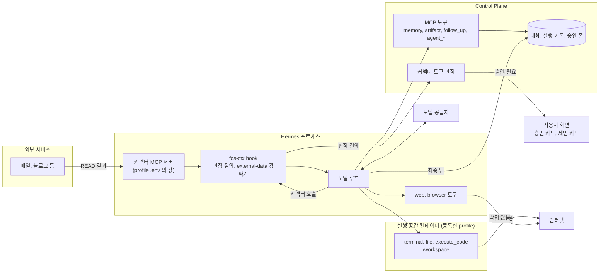

# 커넥터 READ 데이터의 흐름

연결을 붙인 에이전트가 커넥터에서 읽은 글이 모델, 셸, 웹, 다른 커넥터, Memory, 결과물, 기록으로 가는 길을 갖는다.
길마다 지금 무엇이 막고 무엇이 막지 않는지, 제품 정책상 허용인지 승인인지 거절인지를 흐름 판정 코드와 함께 적는다.
원칙과 기본값을 지금 바꾸지 않은 까닭은 [ADR-20261008 / read-data-flow](adr/ADR-20261008-read-data-flow.md) 가 갖는다.

이 문서는 실제 유출 사고를 다루지 않는다. 지원하는 도구로 생길 수 있는 흐름의 범위를 정한다.
각 커넥터의 도구 선언은 [커넥터 도구 정책](backend/connector-tool-policy.md) 이, 실행 공간은 [ADR-086](adr/ADR-086-셸과-파일-도구는-사용자별-docker-실행-공간에서만-돈다.md) 과 [`hermes/sandbox.md`](hermes/sandbox.md) 가 갖는다.

## 원칙

**외부 서비스를 읽을 권한과 읽은 글을 다시 보내고, 오래 남기고, 밖으로 전할 권한은 다르다.**
연결과 바인딩은 앞의 것만 준다. 뒤의 것은 그 글이 가는 곳(sink)마다 따로 정한다.

- 읽은 글은 늘 신뢰하지 않는 글이다. 안에 든 문장이 모델을 속여 다음 도구 호출을 고를 수 있다고 본다
- 출처 표시(`<external-data>`)와 지침은 모델이 그 글을 지시로 읽을 가능성을 줄일 뿐이다. 경계로 세지 않는다
- 경계는 Control Plane 이나 실행 공간이 호출마다 결정적으로 판정하는 곳에만 있다

## 신뢰 경계



| 경계 | 넘을 때 판정하는 곳 | 판정하지 않는 것 |
| --- | --- | --- |
| 외부 서비스에서 모델로 | `fos-ctx` 의 `transform_tool_result` 가 감싼다. 판정은 아니다 | 글의 내용 |
| 모델에서 커넥터 도구로 | `fos-ctx` 의 `pre_tool_call` 이 묻고 Control Plane 이 판정한다 | 인자의 내용과 그 글이 어디서 왔는지 |
| 모델에서 Control Plane 도구로 | Control Plane 이 도구마다 판정한다 | 도구마다 다르다. 아래 「흐름 판정 표」 를 본다 |
| 모델에서 셸, 웹, 브라우저로 | 없다. 도구를 켤 수 있는 등급만 있다 | 명령, 주소, 보낼 글 |
| 셸에서 비밀값으로 | 실행 공간을 적용한 profile 에서는 비밀이 컨테이너에 없다 | 실행 공간을 적용하지 않은 profile |
| 실행 공간에서 인터넷으로 | 없다. 운영이 연결을 기록한다 | 보내는 내용 |

## 보호 수단이 보장하는 범위

| 수단 | 보장하는 것 | 보장하지 않는 것 |
| --- | --- | --- |
| `<external-data>` 감싸기 | 바인딩 profile 의 커넥터 도구 결과에 출처 안내와 닫는 표시 바꾸기를 붙인다. Hermes 의 `<untrusted_tool_result>` 가 그 바깥에 한 번 더 있다 | 모델이 그 글을 지시로 따르지 않는 것. hook 이 실패하면 감싸기 없이 원래 결과가 간다. 셸, 웹, 파일 도구의 결과와 커넥터 출력 파일은 감싸지 않는다 |
| 커넥터 도구 판정 | 바인딩한 커넥터 서버의 도구만 지나간다. `schema: 2` 의 선언 없는 도구, `DESTRUCTIVE`, `FINANCIAL` 은 거절한다. `schema: 1` 의 선언 없는 도구는 쓰기로 읽는다. 쓰기는 승인이나 상시 허락이 있어야 나간다. Control Plane 이 답하지 않거나 틀린 답을 주면 막는다 | 인자에 무엇이 실렸는지, 그 글이 다른 커넥터에서 왔는지. `fos-ctx` 가 꺼지거나 옛 판이면 판정 없이 나간다. 그때 연결 확인이 바인딩을 `PENDING` 으로 둔다 |
| 승인 카드 | 사람이 그 호출의 인자를 보고 정한다. 상시 허락을 닫은 도구는 가려지는 글이 있으면 승인하지 못한다 | 상시 허락이 있는 기간의 호출. 사람이 본문을 읽지 않고 누르는 것 |
| 실행 공간 | 등록한 profile 의 셸, 파일 도구, `execute_code` 가 profile `.env`, 연결 보관 파일, 대응 파일, 다른 사용자의 파일에 닿지 않는다 | 밖으로 나가는 요청. 실행 공간을 적용하지 않은 profile. 컨테이너 밖에서 도는 web, browser 도구 |
| 바인딩의 주인과 공개 범위 | 연결이 붙은 에이전트는 `PRIVATE` 이고 주인이 자기 연결만 붙인다. 남이 주인의 계정으로 외부 서비스를 부르지 못한다 | 주인 자신의 실행 안에서 글이 어디로 가는지 |
| `memory_remember` 의 바깥 도구 확인 | 그 대화의 도구가 모두 안쪽 목록(`McpMemoryRemember.INTERNAL_TOOLS`)에 들 때만 바로 저장할 수 있다. 커넥터 도구, 웹, 하위 에이전트, 맡긴 실행의 답을 돌려주는 `agent_status` 가 하나라도 있으면 제안으로 둔다. 나머지 조건은 [`backend/memory.md`](backend/memory.md) 의 「바로 저장 판정」 이 갖는다. | 사건 저장이 실패해 도구 시작 줄이 빠진 대화 |
| 도구 내용 가림 | 커넥터 도구의 입력과 결과는 실행 기록에 `[연결 도구 내용 가림]`만 남는다. 실행 트리에서 커넥터 호출 뒤에는 일반 도구 내용과 하위 에이전트 목표도 길이만 남긴다. 호출 전에는 비밀 모양을 가리고 500자로 자른다 | 이미 저장된 사건. 이전 turn에서 읽은 본문. Hermes가 보내기 전에 자른 원문 길이 |

## 흐름 판정 코드

코드는 이 문서의 표에서만 쓰는 이름이다. API 응답이나 DB 값이 아니다.
`RISK_NOT_OPEN` 과 `READ_ONLY_RUN` 은 커넥터 판정의 `deny_reason` 과 같은 뜻이다.

| 코드 | 판정 | 뜻 |
| --- | --- | --- |
| `WRAPPED_CONTEXT` | 허용 | 모델 문맥에 출처 표시와 함께 들어간다 |
| `SAME_OWNER_SINK` | 허용 | 그 사용자만 보는 곳에 남는다. 서버 관리자는 DB 에서 볼 수 있다 |
| `REDACTED_RECORD` | 허용 | 기록에는 가린 값만 남는다 |
| `STANDING_GRANT` | 허용 | 사용자가 그 도구에 미리 준 상시 허락으로 나간다. 글의 출처는 보지 않는다 |
| `PER_CALL_APPROVAL` | 사용자 승인 | 호출마다 사람이 인자를 보고 승인해야 나간다 |
| `PROPOSAL_ONLY` | 사용자 승인 | 제안으로만 남고 사람이 받아들여야 효력이 생긴다 |
| `RISK_NOT_OPEN` | 거절 | 위험도가 `DESTRUCTIVE` 나 `FINANCIAL` 이라 늘 거절한다 |
| `READ_ONLY_RUN` | 거절 | 사람이 보지 않는 먼저 살펴보기 트리라 승인 없는 READ 만 받는다 |
| `NO_SESSION` | 거절 | 실행 맥락이 없는 커넥터 호출이다. `execute_code` 안의 호출이 여기 온다 |
| `CREDENTIAL_ABSENT` | 거절 | 실행 공간에 비밀값이 없어 닿을 것이 없다 |
| `HIDDEN_ARGS` | 거절 | 상시 허락을 닫은 도구의 인자에 가려지는 글이 있어 승인해도 실행하지 않는다 |
| `UNMEDIATED_EGRESS` | 통제 없음 | 호출마다 판정하는 곳이 없다. 도구를 켜는 등급과 사후 기록만 있다. 결정으로 감수한다 |
| `OPEN_GAP` | 열린 틈 | 정한 계약과 달리 남거나 감싸지지 않는다. 후속에서 고친다 |

## 흐름 판정 표

출처는 커넥터 READ 도구의 결과다. 예시는 Gmail 메일 본문이지만 가계부나 건강 기록처럼 민감한 READ 도 같다.
판정은 출처를 보지 않으므로 어느 커넥터에서 읽었는지에 따라 달라지지 않는다.

| 번호 | 흐름 | 판정 | 코드 | 판정하는 곳 | 합성 시험 |
| --- | --- | --- | --- | --- | --- |
| RF-01 | READ 결과가 모델 문맥으로 | 허용 | `WRAPPED_CONTEXT` | `fos-ctx` `transform_tool_result` | `test_read_data_flow` `test_read_result_reaches_model_inside_external_data`, `test_fos_ctx` `TransformToolResultTest` |
| RF-02 | 최종 답과 대화 기록으로 | 허용 | `SAME_OWNER_SINK` | 대화 주인 확인 | 별도 시험 없음. 대화 읽기 권한 시험이 본다 |
| RF-03 | 같은 커넥터의 밖으로 나가는 쓰기로 (메일 보내기, 답장) | 사용자 승인 | `PER_CALL_APPROVAL` | Control Plane 판정. `outbound` 와 `"grant": false` | `ToolPolicyDecisionTest` 의 상시 허락을 닫은 도구 시험, `test_read_data_flow` `test_writes_carrying_read_body_are_left_to_control_plane` |
| RF-04 | 다른 커넥터의 쓰기로, 상시 허락이 있을 때 (블로그 임시저장, 메일 초안) | 허용 | `STANDING_GRANT` | Control Plane 판정 | `ToolPolicyDecisionTest` 의 상시 허락 허용 시험, `test_read_data_flow` `test_writes_carrying_read_body_are_left_to_control_plane` |
| RF-05 | 다른 커넥터의 쓰기로, 상시 허락이 없거나 닫혔을 때 | 사용자 승인 | `PER_CALL_APPROVAL` | Control Plane 판정 | `ToolPolicyDecisionTest` |
| RF-06 | `DESTRUCTIVE`, `FINANCIAL` 도구로 | 거절 | `RISK_NOT_OPEN` | Control Plane 판정. 설치가 모델에게서 뺀다 | `ToolPolicyDecisionTest` |
| RF-07 | 먼저 살펴보기 트리 안에서 쓰기로 | 거절. 쓰기를 허용한 살펴보기는 사용자 승인 | `READ_ONLY_RUN`, `PER_CALL_APPROVAL` | Control Plane 판정 | `ToolPolicyDecisionTest` 의 살펴보기 시험 |
| RF-08 | 셸과 `execute_code` 를 거쳐 인터넷으로 | 통제 없음 | `UNMEDIATED_EGRESS` | 없다. 셸 계열은 관리자 등급이다 | `test_read_data_flow` `test_shell_web_and_browser_calls_are_not_inspected` |
| RF-08a | `execute_code` 스크립트 안에서 커넥터 도구로 | 거절 | `NO_SESSION` | `fos-ctx` `pre_tool_call` | `test_read_data_flow` `test_connector_call_from_code_has_no_session_and_is_blocked` |
| RF-09 | `web` 도구의 검색어나 주소로 | 통제 없음 | `UNMEDIATED_EGRESS` | 없다. 연결이 붙은 에이전트에서도 `web`은 주인 등급으로 둔다. 숨은 지시로 본문이 검색어나 주소에 실려 나갈 수 있는 위험을 감당한다(2026-10-08 사용자 결정(#320)) | `test_read_data_flow` `test_shell_web_and_browser_calls_are_not_inspected` |
| RF-10 | 내장 `browser` 도구의 주소로 | 통제 없음 | `UNMEDIATED_EGRESS` | 없다. 관리자 등급이고 profile 틀은 꺼 둔다 | `test_read_data_flow` `test_shell_web_and_browser_calls_are_not_inspected` |
| RF-11 | 사용자 `/workspace` 의 파일로 | 허용 | `SAME_OWNER_SINK` | 실행 공간의 사용자 디렉터리 | 별도 시험 없음. 실행 공간 측정은 [`hermes/sandbox.md`](hermes/sandbox.md) 가 갖는다 |
| RF-12 | `artifact_write` 결과물로 | 허용 | `SAME_OWNER_SINK` | Control Plane. 대화 주인만 읽고 스크립트와 외부 이미지를 막는 머리글을 붙인다. 결과물 안의 링크는 사용자가 누르면 새 창으로 열린다 | `ArtifactTest` 의 머리글 시험과 남의 대화 시험, `test_read_data_flow` `test_control_plane_sinks_keep_body_and_get_signed_context` |
| RF-13 | `memory_remember` 로 | 사용자 승인 | `PROPOSAL_ONLY` | Control Plane. 대화에 바깥 도구가 있으면 제안이다 | `McpMemoryRememberToolTest` 의 커넥터 READ 시험과 바깥 도구 시험 |
| RF-14 | `follow_up_propose` 로 | 사용자 승인 | `PROPOSAL_ONLY` | Control Plane. 사람이 받아들여야 할 일이 된다 | `McpFollowUpToolTest` |
| RF-15 | `agent_delegate` 의 `task` 로 다른 에이전트에 | 허용. 결과가 돌아올 때 감싸지 않는다 | `SAME_OWNER_SINK`, `OPEN_GAP` | Control Plane. 대상은 요청자 소유이거나 그룹 공개 에이전트다. 자식 실행은 요청자 명의이고 대상 에이전트의 도구로 돈다. 그 도구로 가는 흐름은 이 표의 다른 줄이 정한다. 결과는 다음 turn 전달과 `agent_status` 두 길로 돌아온다 | `test_read_data_flow` `test_control_plane_sinks_keep_body_and_get_signed_context` |
| RF-16 | 실행 기록의 도구 내용으로 | 허용(가림). 트리에서 커넥터 호출 뒤에는 일반 도구도 이름과 받은 내용의 길이만 남긴다(#319) | `REDACTED_RECORD` | `ToolDetailRedactor`, `HermesRunEventStream`. 커넥터 정책 기록으로 루트와 자식, 형제를 함께 확인한다. 이력 조회 실패도 가린다 | `ToolDetailRedactorTest`의 다른 도구 인자 시험, `ToolDetailEventStreamTest`의 호출 전후와 트리 이력 시험, `ConnectorCallHistoryTest` |
| RF-17 | 승인 줄로 | 허용 | `SAME_OWNER_SINK` | 승인 줄에 인자 원문이 16KB 까지, 결과 글이 남는다. 주인 화면은 가린 인자를 받는다 | `ConnectorActionServiceTest` |
| RF-18 | `fos-ctx` 와 backend 로그로 | 허용(가림) | `REDACTED_RECORD` | hook 은 인자와 결과 본문을 로그에 남기지 않는다. backend 는 도구 인자와 결과를 로그에 남기는 줄이 없다(코드 확인, 시험 없음). Hermes core 의 로그는 확인하지 않았다 | `test_fos_ctx` 의 `test_logs_hide_token_signature_and_args`, `test_unreadable_tool_map_returns_none_without_leaking` |
| RF-19 | 커넥터 출력 파일로 | 허용 | `SAME_OWNER_SINK` | 그 profile 의 실행 공간에만 읽기 전용으로 붙는다. 셸이 읽은 뒤는 RF-08 과 같다 | `test_dashboard_profile_api_connector_binding_output`, `test_dashboard_profile_api_sandbox_terminal` 의 출력 디렉터리 읽기 전용 시험 |
| RF-20 | 모델 공급자로 | 허용 | `WRAPPED_CONTEXT` | 없다. 대화에 쓰인 글은 요청의 일부다([`privacy.md`](privacy.md)) | 해당 없음 |
| RF-21 | 그 밖의 주인 등급 도구로 (`vision`, `tts`) | 통제 없음 | `UNMEDIATED_EGRESS` | 없다. `vision_analyze`는 모델이 준 HTTP(S) 주소를 Hermes에서 내려받는다. 주소 안전성과 사이트 정책 검사는 READ 본문 반출을 판정하지 않으므로 RF-09와 같은 길이다 | Hermes v0.21.5 소스 확인(2026-10-08). 아래 근거를 본다 |
| RF-22 | 그 밖의 관리자 등급 도구로 (`image_gen`, `video_gen`, `discord`, `homeassistant`, `spotify`, `computer_use`, `cronjob`, `session_search`) | 통제 없음 | `UNMEDIATED_EGRESS` | 없다. 관리자가 켠다. `cronjob` 은 글을 Hermes 예약 작업에 오래 남기고 그 작업은 local 로 돈다(RC-02) | 해당 없음 |

RF-21은 Hermes v0.21.5(태그 `v2026.9.24`)의 소스로 확인했다.
[`vision_tools.py`](https://github.com/NousResearch/hermes-agent/blob/v2026.9.24/tools/vision_tools.py)의 `_handle_vision_analyze`는 `image_url`을 `_prepare_image`로 넘긴다.
[`image_source.py`](https://github.com/NousResearch/hermes-agent/blob/v2026.9.24/tools/image_source.py)의 `resolve_image_source`는 HTTP(S) 입력을 `_download_to_bytes`로 내려받는다.
그 함수가 부르는 `_download_image`와 `_download_media`는 주소 검사 뒤 HTTP GET을 보낸다.
이 확인은 도구의 등급이나 승인 계약을 바꾸지 않는다.

비밀값(OAuth 토큰, 원격 디버깅 주소, MCP 토큰)의 흐름이다.

| 번호 | 흐름 | 판정 | 코드 | 판정하는 곳 | 합성 시험 |
| --- | --- | --- | --- | --- | --- |
| RC-01 | 실행 공간을 적용한 profile 의 셸이 `.env` 나 보관 파일로 | 거절 | `CREDENTIAL_ABSENT` | 실행 공간에 그 경로가 없다 | 운영과 같은 이미지의 측정. [`hermes/sandbox.md`](hermes/sandbox.md) 의 「측정 결과」 |
| RC-02 | 실행 공간을 적용하지 않은 profile 의 셸이 `.env` 나 보관 파일로 | 통제 없음 | `UNMEDIATED_EGRESS` | 없다. ADR-083 이 감수한다 | 해당 없음 |
| RC-03 | 스킬 앞머리가 값을 실행 공간에 넣게 하는 길 | 거절 | `CREDENTIAL_ABSENT` | Control Plane 의 스킬 저장과 도구 저장(`AGENT_SKILL_REQUESTS_SECRETS`), 대시보드 plugin 의 manifest 검증 | `SkillFrontmatterTest`, `AgentToolServiceTest`, `test_connectors_contract` |
| RC-04 | 실행 기록, 승인 카드, 응답으로 | 허용(가림) | `REDACTED_RECORD` | `ToolDetailRedactor`. 비밀 모양과 비밀 키 이름의 값을 가린다 | `ToolDetailRedactorTest` |
| RC-05 | 상시 허락을 닫은 쓰기의 인자로 | 거절 | `HIDDEN_ARGS` | 가려지는 글이 있는 승인 줄은 승인하지 못한다 | `ConnectorActionServiceTest` |

## 열린 틈

정한 계약과 달라 고칠 것이다. 판정 표의 `OPEN_GAP` 이 여기 해당한다.

| 틈 | 지금 | 고칠 방향 |
| --- | --- | --- |
| 이전 turn의 본문 | 커넥터 호출 뒤 일반 도구와 하위 에이전트 목표는 가리지만, 새 실행 트리는 이전 turn에서 읽은 본문까지 추적하지 않는다. 이미 저장된 사건도 다시 가리지 않는다 | 대화 이력을 포함한 가림 범위는 별도 결정이 필요하다 |
| 바인딩 에이전트의 위임 결과 | 위임 결과를 `ExternalData` 로 감싸는 판정이 옛 커넥터 에이전트(`connectorManaged`)만 본다. 다음 turn 으로 전하는 길(`ChatDeliveryInput.isExternalResult`)과 `agent_status` 의 답(`McpToolService`)이 같다. 연결을 붙인 일반 에이전트의 결과는 두 길 모두 감싸지 않는다 | 두 길 모두 연결이 붙은 에이전트의 결과도 감싼다 |

## 실행 공간이 해결한 것과 남은 것

| 해결한 것 | 남은 것 |
| --- | --- |
| 등록한 profile 의 셸, 파일 도구, `execute_code` 가 profile `.env`, 연결 보관 파일, 대응 파일, `fos-ctx` 설정에 닿지 않는다. 셸로 승인을 비켜 가는 세 길(토큰 직접 사용, 대응 파일 고치기, hook 끄기)이 막힌다 | 밖으로 나가는 요청을 막지 않는다. 승인 없이 부른 READ 결과를 셸이 인터넷으로 보낼 수 있다(RF-08) |
| 다른 사용자의 `/workspace` 와 첨부가 보이지 않는다 | 같은 사용자의 에이전트끼리는 `/workspace` 를 함께 쓴다. 웹 도구가 없는 에이전트가 쓴 파일을 셸이 있는 다른 에이전트가 읽어 보낼 수 있다 |
| `execute_code` 안에서 커넥터 도구를 부르지 못한다(RF-08a) | web 과 browser 도구는 컨테이너 밖 Hermes 프로세스에서 돈다. 실행 공간과 상관없이 RF-09, RF-10 이 남는다 |
| 스킬 앞머리로 값을 넣는 길을 저장 때 막는다(RC-03) | 정책에 등록하지 않은 profile 과 기존 Hermes 예약 작업은 local 로 돈다. 그곳에서는 RC-02 가 남는다 |
| | 운영자가 읽기 전용으로 붙인 token 파일은 그 실행 공간에서 셸이 읽는다 |

## 운영 기본값을 검토한 결과

민감한 연결이 붙은 에이전트에서 셸이나 임의 네트워크를 기본으로 막는 안을 검토했다.
**지금은 기본값을 바꾸지 않는다.** 까닭과 버린 대안은 [ADR-20261008 / read-data-flow](adr/ADR-20261008-read-data-flow.md) 가 갖는다.

`web`의 주인 등급 유지는 2026-10-08 사용자 결정(#320)으로 확정했다.
첫 로그인에 만든 기본 에이전트는 실행 공간이 있으면 셸, 파일, `execute_code` 를 켜고 시작한다([ADR-20261008 / default-toolsets](adr/ADR-20261008-default-toolsets.md)). 그 에이전트에 연결을 붙이면 RF-08 이 관리자가 고르지 않아도 열린다. 실행 공간이 없으면 셸 계열을 빼므로 RC-02 는 기본값으로 열리지 않는다.
RF-09의 반출 위험을 감당하고, RF-21의 `vision_analyze`도 주소를 내려받는 길로 확인했다.
실행 공간의 밖으로 나가는 요청을 허용 목록으로 거르는 것은 ADR-086이 실측 비용을 본 뒤 다시 정하기로 했다.

사용자가 명시적으로 승인한 여러 출처의 작업은 막지 않는다. 메일을 읽고 그 내용으로 자기 블로그 임시저장을 만드는 것이 그 예다(RF-04).

## 시험을 돌리는 법

합성 시험은 지어낸 메일 본문과 `example` 주소만 쓴다.
표에서 시험이 「해당 없음」 이거나 「별도 시험 없음」 인 줄은 판정하는 곳이 이 저장소의 코드 밖에 있거나 운영 측정으로 확인한 줄이다.

```bash
# cwd: 저장소 root
python3 -m unittest discover -s hermes/tests -p 'test_read_data_flow.py'
# cwd: backend/
./gradlew test --tests '*ToolDetailRedactorTest' --tests '*McpMemoryRememberToolTest' --tests '*ToolPolicyDecisionTest'
```
