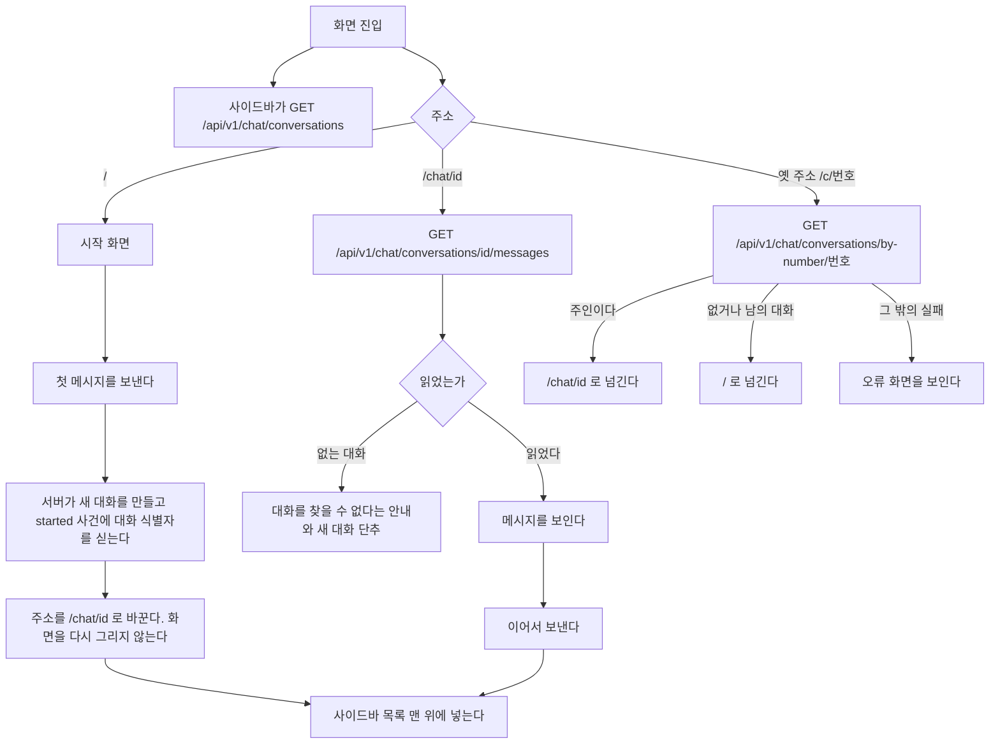
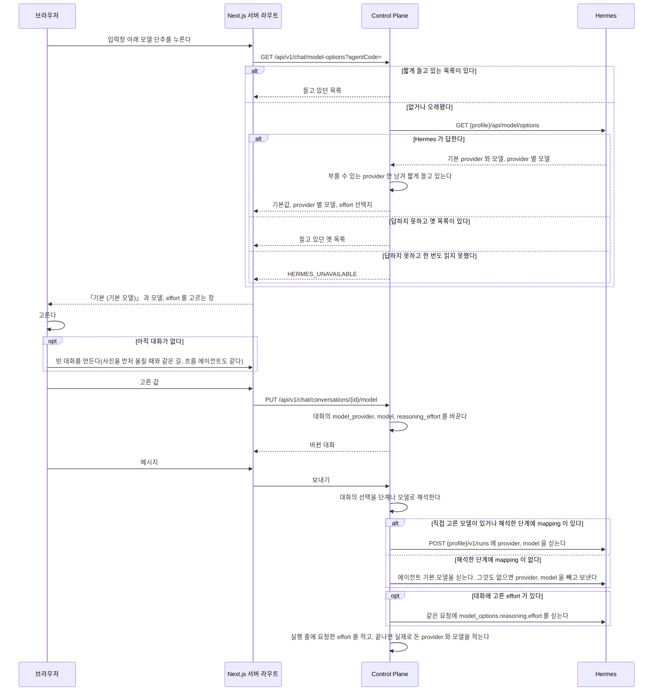
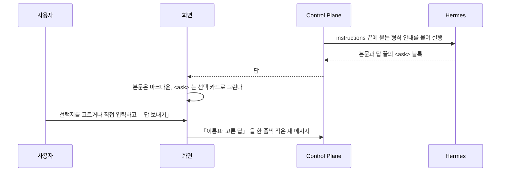
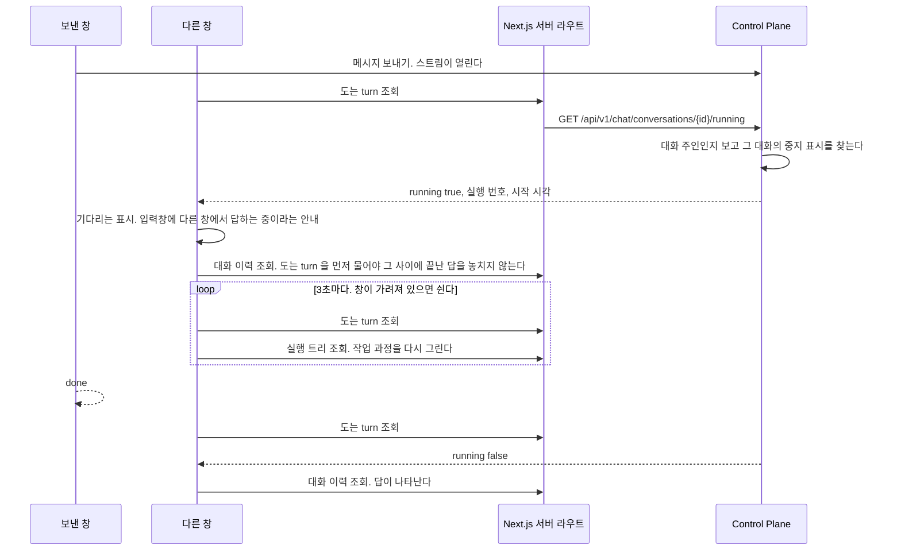
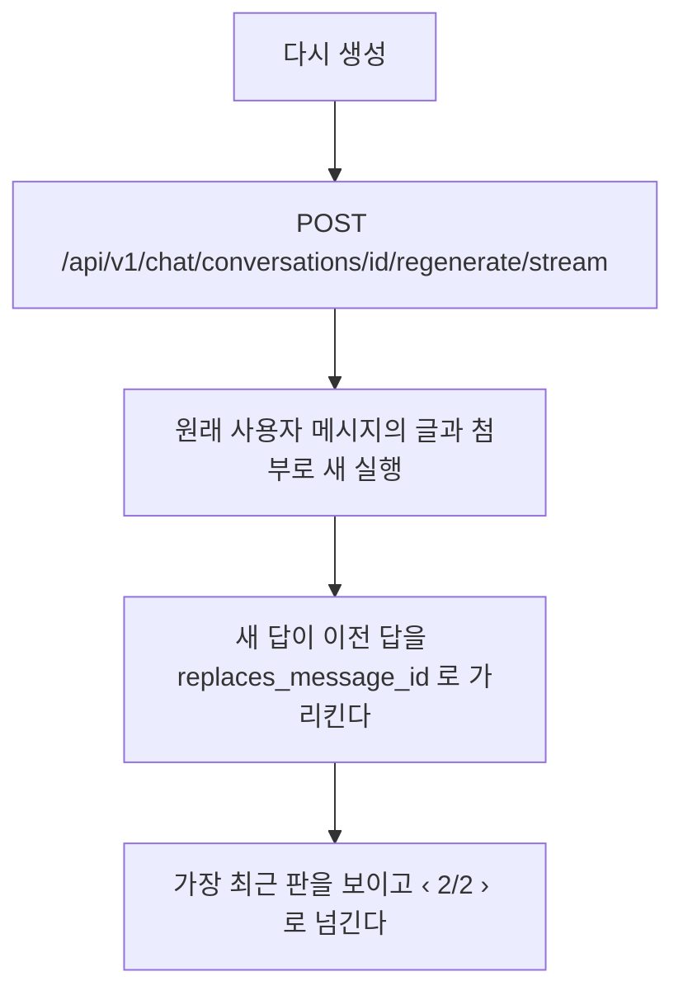
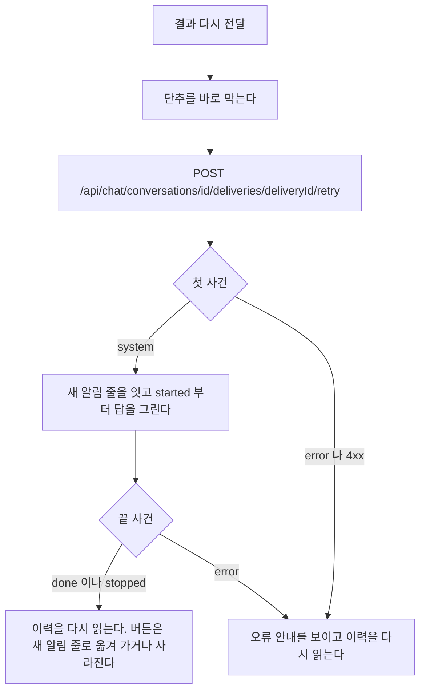

# web 화면의 흐름

사용자가 화면에서 하는 일마다 화면과 Control Plane 이 주고받는 순서와, 실패와 빈 상태와 동시 요청에서 갈리는 지점을 갖는다.
화면이 보이는 것은 [`prd.md`](prd.md), 화면 목록과 틀은 [`code-architecture.md`](code-architecture.md) 가 갖는다.

## 대화 이력

브라우저를 새로 고쳐도 이어서 말할 수 있어야 한다.
대화와 메시지는 데이터베이스에 남아 있으므로 화면이 그것을 읽는다.

**대화마다 주소가 있다.** `/chat/{대화 식별자}` 다.
대화 식별자는 대화를 만들 때 정하는 UUID 다. 대화 표의 번호는 주소에 나오지 않는다.
`/` 는 새 대화를 시작하는 화면이고 지난 대화를 저절로 열지 않는다.
주소를 즐겨찾기하거나 다른 탭에 열 수 있게 하기 위해서다.



첫 메시지를 보내고 주소를 바꿀 때 화면을 다시 그리지 않는다.
경로를 옮기면 대화 화면이 새로 만들어져 흘러오던 답을 잃는다.
`window.history.replaceState` 로 주소만 바꾼다.

**주소만 바꿨으므로 그 뒤 「새 대화」 를 눌러도 화면이 새로 만들어지지 않을 수 있다.**
그래서 대화 화면은 주소가 `/` 인데 대화 식별자를 들고 있으면 스스로 상태를 비운다.
`started` 가 오기 전에 다른 대화로 옮겼으면 늦게 온 `started` 로 주소를 바꾸지 않는다.

**상태를 비우는 것은 대화별 상태를 가진 부품을 새로 만드는 것이다.**
대화 화면은 두 겹이다.

| 부품 | 갖는 것 | 언제 새로 만들어지나 |
| --- | --- | --- |
| `components/chat-panel.tsx` 의 `ChatPanel` | 에이전트 목록, 새 대화에서 고른 에이전트, 지금 대화의 식별자, 대화 상태를 몇 번째로 만들었는지 | 경로가 바뀔 때. Next.js 가 새로 만든다 |
| `components/chat/conversation-session.tsx` 의 `ConversationSession` | 메시지, 보내는 중인 turn, 작업 과정, 옆 패널, 오류 문구, 쓰던 글, 입력창과 올린 사진, 대기 줄, 대화 단위 SSE 연결 | `ChatPanel` 이 `key` 를 올릴 때 |

`ChatPanel` 은 아래 셋에서만 `key` 를 올린다.

- 주소가 `/` 로 바뀌었고 대화 식별자를 들고 있다
- 「새 대화」 를 눌렀다
- 받은 대화 식별자가 다른 대화로 바뀌었다

대화 식별자가 새로 생긴 것은 여기 들지 않는다. 그때 새로 만들면 흘러오던 답과 올리던 사진을 잃는다.
상태를 하나씩 되돌리지 않고 부품을 새로 만들므로, 대화별 상태를 더해도 되돌리는 자리를 따로 고치지 않는다.
없어진 `ConversationSession` 이 받던 스트림은 서버에서 계속 돌지만, 늦게 온 사건은 화면과 주소를 바꾸지 않는다.

**대화 식별자는 두 자리에서 생긴다.** 첫 메시지의 `started` 와, 새 대화에서 첫 사진을 올리기 전에 만드는 빈 대화다.
빈 대화의 규칙은 [`backend/docs/flow.md`](../../backend/docs/flow.md) 의 「경로(사진 첨부)」 절이 갖는다.
두 자리 모두 식별자를 받는 즉시 주소를 `/chat/{id}` 로 바꾼다.
그래서 상태를 비우는 것은 주소가 `/` 로 **바뀌었을 때**나 「새 대화」 를 눌렀을 때뿐이다.
주소가 `/` 인 채 식별자를 들고 있는 것만 보고 비우면, 사진을 올리는 순간 방금 만든 대화가 지워진다.

### 갈리는 지점

| 상황 | 화면 |
| --- | --- |
| 대화가 하나도 없다 | 사이드바 목록 자리에 아직 대화가 없다는 한 줄. 시작 화면은 그대로 쓴다 |
| 메시지를 읽지 못했다 | 그 대화만 오류를 보이고 목록은 남긴다 |
| 남의 대화나 지운 대화의 주소다 | 없는 것과 같은 오류다. 대화를 찾을 수 없다는 안내와 새 대화 단추를 보인다 |
| 옛 주소 `/c/{번호}` 로 들어왔다 | 주인이면 `/chat/{id}` 로 넘긴다. 없거나 남의 대화면 `/` 로 넘긴다. 둘을 가리지 않는다 |
| 옛 주소의 번호 조회가 없는 대화가 아닌 까닭으로 실패했다 | `/` 로 넘기지 않고 오류 화면을 보인다. 서버 오류를 첫 화면으로 덮지 않는다 |
| 대화 식별자가 UUID 모양이 아니다 | `/` 로 넘긴다 |
| 대화 식별자에 대문자가 섞였다 | 소문자 주소 `/chat/{id}` 로 넘긴다. 사이드바가 주소를 소문자 식별자와 그대로 비교한다 |
| 보내는 중이다 | 보내기 단추 옆에 중지 단추가 나온다. 보내기는 그대로 눌린다. [`backend/docs/flow.md`](../../backend/docs/flow.md) 의 「응답 중에 보낼 때」 절이 갖는다 |
| `started` 전에 실패했다 | 쓴 문장을 입력창에 되돌려 다시 보낼 수 있게 한다. 서버에 아무것도 남지 않았다 |
| `started` 뒤에 실패했다 | 사용자 메시지는 서버에 남았다. 입력창에 되돌리지 않고 그 메시지 아래에 오류와 「다시 시도」 를 보인다 |
| 앞의 답이 끝나기 전에 또 보냈다 | 두 번째 글은 대기 메시지로 쌓인다. 다른 탭에서 보내도 같다. [`backend/docs/flow.md`](../../backend/docs/flow.md) 의 「응답 중에 보낼 때」 절이 갖는다 |
| 보내는 중에 다른 대화를 고른다 | 고를 수 있다. 앞 실행은 서버에서 계속 돌고 끝나면 저장된다 |

실패한 요청의 문장을 되돌리는 것이 중요하다.
보내는 순간 입력창을 비우므로, 되돌리지 않으면 사용자가 쓴 문장이 사라진다.
**다만 `started` 가 온 뒤라면 되돌리지 않는다.** 서버에 이미 저장된 질문이라, 되돌려 다시 보내면 같은 질문이 둘 남는다.
「다시 시도」 는 다시 생성과 같은 경로다. [`web/docs/flow.md`](flow.md) 의 「다시 생성」 절이 갖는다.

## 모델을 고를 때

에이전트는 모델을 갖지 않는다. 사용자가 대화에서 모델과 reasoning effort 를 고른다.
선택은 `DEFAULT`, `TIER`, `CUSTOM` 세 모드다. 고르지 않은 대화가 어느 모델로 도는지는 [모델 단계](../../backend/docs/flow.md) 의 「모델 선택」 이 정한다.
근거는 [ADR-030](../../backend/docs/adr/ADR-030-모델과-effort-는-대화가-고르고-기본값은-hermes-profile-이-갖는다.md) 에 있다.



### 모델 선택이 갈리는 지점

| 무엇 | 어떻게 되나 |
| --- | --- |
| Hermes 가 목록을 주지 못하고 들고 있던 목록이 있다 | 들고 있던 옛 목록을 보인다 |
| Hermes 가 목록을 주지 못하고 그 profile 의 목록을 한 번도 읽지 못했다 | `HERMES_UNAVAILABLE` 이다. 목록 창에 불러오지 못했다고 보인다. 대화는 기본값으로 계속 보낼 수 있다. 다만 그룹에 숨김이 있고 에이전트 기본 모델이 없는 에이전트는 판정할 수 없어 실행도 `HERMES_UNAVAILABLE` 로 거절한다 |
| 그룹에 숨김이 있고 요청에 모델을 싣지 않는 실행이다 | 들고 있는 목록의 profile 기본 모델을 숨김과 견준다. 숨긴 모델이면 제출하지 않고 `MODEL_HIDDEN` 으로 실패한다. 자세한 것은 [모델 단계와 실행 기록](../../backend/docs/flow.md)의 「요청에 모델을 싣지 않는 실행」 에 있다 |
| 목록에 `authenticated` 가 거짓인 provider 가 있다 | 뺀다. 부를 수 없는 provider 다 |
| 고른 모델이 나중에 목록에서 빠졌다 | 대화에 적힌 값을 그대로 보낸다. 모델을 찾지 못하면 Hermes 가 그 실행을 실패로 끝내고, 사용자가 다른 모델을 고른다. 고르는 창은 목록에 없거나 목록을 읽지 못해도 대화에 적힌 모델을 선택지에 남긴다. effort 만 바꿔도 모델이 「기본」 으로 돌아가지 않게 한다 |
| provider 와 모델 중 하나만 온다 | 거절한다. 둘은 함께 채우거나 함께 비운다 |
| provider 나 모델이 대화 표의 칸 길이를 넘는다 | 거절한다 |
| effort 가 선택지에 없는 값이다 | 거절한다 |
| 모델의 reasoning 지원이 `UNKNOWN` 이다 | effort 를 고르게 둔다. 고급 모델 선택 창에서만 「지원을 확인하지 못했어요」 를 보인다. 입력창의 단계 단추 화면에는 문구를 더하지 않는다 |
| 모델이 reasoning 을 받지 않는다(`UNSUPPORTED`) | effort 를 고르지 못하게 하고 이미 고른 값은 저장하지 않는다 |
| 모델이 받지 않는 effort 를 골랐다 | 그대로 보낸다. Hermes 가 그 provider 의 값으로 맞춘다. 요청한 값이지 적용한 값이 아니다 |
| `none`(reasoning 끄기)을 골랐다 | 모델의 `disable` 이 `SUPPORTED` 일 때만 선택지에 보인다. 서버도 그 밖의 모델은 `VALIDATION_FAILED` 로 거절한다. 「기본」 과 `none` 은 다르다. 「기본」 은 effort 를 보내지 않는다 |
| 모델을 바꿨는데 이전 모델에서 고른 effort 가 새 모델에서 허용되지 않는다 | 창의 임시 선택을 「기본」 으로 비운다. 저장된 대화의 값은 사용자가 적용하기 전에는 바꾸지 않는다 |
| 도는 turn 이 있는데 바꾼다 | 받는다. 도는 turn 은 시작할 때의 값으로 끝난다. 그 turn 의 Memory 제안과 흐름의 남은 하위 실행도 같다. 바꾼 값은 다음 보내기부터 쓴다. 화면도 답을 만드는 동안 단추를 막지 않는다 |
| 저장하는 중이다 | 단추는 고른 값을 먼저 보이고, 보내기와 추천 질문을 막는다. 저장이 끝나기 전에 보낸 메시지가 이전 값으로 돌지 않게 한다 |
| 저장하지 못했다 | 단추가 이전 값으로 돌아가고 「모델을 바꾸지 못했어요. 잠시 뒤 다시 시도해 주세요.」 를 보인다. 빈 대화를 만들지 못했으면 입력창이 알린 오류만 보인다 |
| 고를 에이전트가 아직 없다 | 단추를 막는다. 빈 대화를 만들 에이전트가 정해지지 않았다 |
| 기존 대화의 목록 줄이 아직 오지 않았다 | 단추를 막는다. 대화에 적힌 모델을 모르는 채 고르게 하면 「기본」 으로 저장해 적힌 모델을 지우게 된다. 목록 읽기가 실패하면 다음에 목록을 읽어 올 때까지 막혀 있다 |
| 남의 대화다 | 없는 대화와 같은 응답이다 |
| 고른 모델의 provider 가 막혔다 | 그 실행은 `PROVIDER_BLOCKED` 로 실패한다. Control Plane 은 다른 모델로 넘기지 않는다 |
| 다시 생성, Memory 제안, 흐름의 하위 실행 | 그 대화에 적힌 값을 쓴다 |

모델 목록은 저장하지 않는다. Hermes 가 답한 것을 Control Plane 메모리에 10분 들고 있는다.
profile 마다 따로 들고 있고, Control Plane 이 다시 뜨면 비어서 시작한다.
다시 읽기가 실패하면 옛 목록을 쓰고 1분 뒤에 다시 읽는다.

## 에이전트가 물을 때

에이전트가 이어 가려면 사용자가 정하거나 알려 줘야 하는 것이 있으면, 답 끝에 `<ask>` 블록을 둔다.
화면이 그 블록을 선택 카드로 그리고, 고른 답이 평범한 다음 메시지로 나간다.
근거는 [ADR-026](../../docs/adr/ADR-026-에이전트가-물을-것은-답-끝의-태그로-두고-화면이-카드로-그린다.md) 에 있다.



형식은 한 줄에 태그 하나다.

```
<ask>
<question header="식당 이름">어느 식당에 다녀왔어?</question>
<option>행복담</option>
<option description="사진의 간판 글자">행복한 담벼락</option>
</ask>
```

**실행은 답을 기다리지 않는다.** 답을 보내는 순간 끝나 있고, 답은 다음 turn 으로 온다.
그래서 기다리는 상태와 시간 제한이 없다. 카드를 무시하고 입력창에 다른 글을 보내도 된다.

형식 안내는 사용자가 직접 답하는 대화 실행에만 붙는다. 흐름의 Chief 와 자식에게는 붙이지 않는다.
실행 기록의 `context_chars`와 `instructions_hash`는 공통 답변 지침과 Memory 문맥을 대상으로 한다.
Memory가 없어도 공통 표 지침의 길이와 지문을 기록하며, 이 묻는 형식 안내는 제외한다.

### 질문 카드가 갈리는 지점

| 상황 | 화면 |
| --- | --- |
| 마지막 답의 카드 | 누를 수 있다. 모든 질문에 답해야 「답 보내기」 가 켜진다 |
| 지난 답의 카드 바로 다음 메시지가 카드 답 형식일 때 | 고른 선택지와 직접 입력한 답을 보인다. 새로 고침 뒤에도 대화 기록에서 되찾는다. 누를 수 없다 |
| 지난 답의 카드 바로 다음 메시지가 다른 글일 때 | 무엇을 물었는지만 보인다. 누를 수 없다 |
| 돌고 있는 turn 이 있을 때, 이전 버전을 보고 있을 때 | 누를 수 없다 |
| 보낸 답이 전송에 실패했을 때 | 그 답이 다시 마지막이 되어 카드를 다시 누를 수 있다 |
| 직접 입력을 골라 놓고 비워 둠 | 그 질문은 답하지 않은 것으로 본다 |
| 선택지가 없는 질문 | 직접 입력 칸만 보인다 |
| `multiple="true"` | 여럿을 고를 수 있다. 고른 것을 쉼표로 이어 보낸다 |
| 스트리밍 중에 아직 닫히지 않은 블록 | 그 자리부터 그리지 않는다. 반쯤 온 태그가 글자로 보이지 않게 한다 |
| 모양이 어긋난 블록, 끝까지 닫히지 않은 블록 | 카드 대신 원문을 코드 블록으로 보인다 |
| 코드 블록 안의 `<ask>` | 예시로 보고 카드로 그리지 않는다 |
| 한 답에 블록이 여럿 | 마지막 카드만 누를 수 있다 |

질문 수와 질문마다의 선택지 수, 이름표와 질문과 선택지와 설명의 길이에 상한이 있다. 값은 `web/src/lib/ask.ts` 가 갖는다.
상한을 넘거나 같은 이름의 선택지가 둘이면 어긋난 블록으로 본다.
형식 안내도 같은 상한을 에이전트에게 알린다.

## 다른 창에서 답하는 중일 때

한 사람이 같은 대화를 두 창에서 연다. 한 창에서 보낸 질문의 답이 아직 오는 중이다.
다른 창은 그 답이 오는 중이라는 것을 보여 주고, 답이 끝나면 저장된 이력을 다시 읽는다.

**답 조각은 다른 창으로 보내지 않는다.** 스트리밍은 보낸 창에만 간다.
다른 창은 기다리는 표시와 작업 과정만 보이고, 답 본문은 끝난 뒤 이력으로 받는다.



| 상황 | 다른 창 |
| --- | --- |
| 도는 turn 이 없다 | 여느 때처럼 연다. 조회를 되풀이하지 않는다 |
| 실행 번호가 아직 없다 | 기다리는 표시만 보인다. 중지 단추는 눌리지 않는다. 다음 조회에서 번호를 받는다 |
| 다른 창에서 중지를 누른다 | 보낸 창과 같은 중지 경로다. 끝나면 두 창 모두 이력에서 「중지됨」 을 본다 |
| 끝났다 | 조회를 멈추고 이력을 다시 읽는다 |
| 조회가 실패한다 | 다음 주기에 다시 묻는다. 세 번 이어 실패하면 기다리는 표시를 거두고 이력을 다시 읽는다 |
| 조회하는 동안 대화가 지워졌다 | 조회를 멈추고 대화를 찾을 수 없다는 화면을 보인다 |
| 다른 대화로 옮기거나 창을 닫는다 | 조회를 멈춘다 |

보낸 창은 스트림이 이어지는 동안 이 조회를 하지 않는다. 자기 스트림으로 끝을 안다.

**보낸 창도 스트림이 끊기면 보는 창이 된다.**
`done` 이나 `stopped` 나 `error` 없이 스트림이 끝나면 오류로 끝내지 않고 도는 turn 을 묻는다.
보내기와 다시 생성이 같다.
실제로 끊긴 뒤에도 실행은 13분을 더 돌아 성공했는데 화면은 그동안 실패로 보였다.

| 상황 | 스트림이 끊긴 보낸 창 |
| --- | --- |
| turn 이 돌고 있다 | 이력을 다시 읽고 보는 창과 같은 상태로 바뀐다. 입력창 위에 응답 연결이 끊겨 답을 기다리는 중이라는 안내를 보인다 |
| turn 이 끝났고 답이 이력에 있다 | 이력을 다시 읽어 답을 보인다. 오류 문구를 띄우지 않는다 |
| turn 이 돌지 않고 답도 없다 | 응답 연결이 끊겼다는 안내와 답을 받지 못했다는 안내를 보인다. 끊기기 전과 같다 |
| `started` 전에 끊겼고 turn 이 돌지 않는다 | 이력에 새 질문이 저장돼 있으면 응답 연결이 끊겼다는 안내와 답을 받지 못했다는 안내를 보이고 글을 되돌리지 않는다. 저장된 질문과 되돌린 글이 함께 있으면 다시 보낼 때 질문이 두 번 저장되기 때문이다. 새 질문이 없을 때만 보낸 글을 입력창에 되돌린다 |
| 묻는 사이 대화가 지워졌다 | 대화를 찾을 수 없다는 화면을 보인다. 대화를 열 때와 보는 중과 같다 |
| 새 대화가 대화 번호를 받기 전에 끊겼다 | 물을 대화가 없다. 보낸 글을 입력창에 되돌리고 응답 연결이 끊겼다는 안내를 보인다 |

넘어갈 때 받던 답 조각은 치운다. 저장된 답이 아니고, 남기면 기다리는 표시 대신 멈춘 답처럼 보인다.
보내며 붙인 임시 질문은 이력을 다시 읽을 때 저장된 질문으로 바뀐다.
이미 받은 작업 과정은 그대로 두고 다음 실행 트리 조회 결과로 바꾼다.
끝나면 이력을 다시 읽으므로 화면에는 저장된 것만 남는다.

같은 창을 새로 고친 것도 보는 창이다. 새로 고친 창에는 보낸 스트림이 없다.
그 창은 자기가 보낸 turn 인지 알 수 없어 다른 창에서 답하는 중이라는 안내를 보인다.

다른 창에서도 입력창은 잠기지 않는다. 보낸 글은 대기 메시지로 쌓이고, 대기 줄은 `pending` 사건으로 모든 창이 같이 본다.
대화 사건 연결을 처음 열거나 다시 붙인 뒤에는 대기 줄을 다시 읽어, 연결 직전의 변경도 화면에 맞춘다.
사진 첨부와 다시 생성은 답이 끝날 때까지 잠긴다.

## 다시 생성

마지막 답 아래에 다시 생성 아이콘 단추가 있다. 그보다 앞의 답에는 없다.
접근성 이름과 마우스를 올리거나 초점을 줬을 때의 풀이는 「다시 생성」 이다.

**사용자 메시지는 고치지 않는다.** 질문을 바꾸고 싶으면 돌고 있는 답을 중지하고 새 메시지로 보낸다.
근거는 [ADR-024](../../docs/adr/ADR-024-메시지-수정을-없애고-중지한-뒤-다시-보낸다.md) 에 있다.

**마지막 메시지가 답 없는 사용자 메시지일 때도 다시 생성을 연다.** 화면은 이것을 「다시 시도」 로 보인다.
실패했거나 남긴 답 없이 중지된 turn 이 그렇다.
그때 새 답은 가리킬 이전 답이 없어 `replaces_message_id` 가 비어 있다.
근거는 [ADR-022](../../docs/adr/ADR-022-다시-생성과-수정은-같은-session-에-판으로-쌓는다.md) 에 있다.



실행 입력의 `instructions` 끝에 한 줄을 덧붙인다.
앞의 답을 되풀이하지 말라는 것이다.
**사용자 메시지의 글은 고치지 않는다.**

| 상황 | 응답 |
| --- | --- |
| 대상이 마지막 메시지가 아니다 | `MESSAGE_NOT_LATEST`. 화면이 이력을 다시 읽는다 |
| 그 대화에서 도는 실행이 있다 | `CONVERSATION_BUSY`. 끝난 뒤에 다시 누르게 한다 |
| 그 사용자가 동시 실행 한도를 모두 쓰고 있다 | `USER_BUSY`. 진행 중인 작업이 끝난 뒤 다시 누르게 한다([`backend/docs/flow.md`](../../backend/docs/flow.md)) |
| 다시 생성이 실패했다 | 이전 판이 그대로 남는다. 새 판은 생기지 않는다 |

**판은 답 한 줄 단위다.**
예전에 수정으로 생긴 사용자 메시지의 판은 데이터베이스에 남아 있어, 화면이 그 turn 의 판도 넘겨 볼 수 있게 둔다.
새로 만드는 경로는 없다.

## 결과 다시 전달

맡긴 일의 결과를 부모 에이전트가 정리하지 못했으면, 그 결과의 알림 줄 아래에 상태와 「결과 다시 전달」 이 보인다.
누르면 저장된 결과만 다시 넘겨 답을 받는다. 맡긴 일이나 승인한 동작을 다시 실행하지 않는다.
결정은 [ADR-075](../../docs/adr/ADR-075-결과-전달은-묶음과-시도로-남기고-사용자가-저장된-결과만-다시-전달한다.md), 서버의 판정은 [`backend/docs/flow.md`](../../backend/docs/flow.md) 의 「결과 전달이 끝나지 않았을 때」 에 있다.

이력 API 의 `SYSTEM` 줄에는 `delivery` 가 붙을 수 있다. `{ "id": 12, "status": "FAILED" }` 모양이고, 그 묶음의 마지막 시도가 저장한 마지막 알림 줄에만 붙는다.
오류 코드는 싣지 않는다. 원인은 관리자 영역의 실행 상세에서 본다.

| `delivery.status` | 알림 줄 아래 | 버튼 |
| --- | --- | --- |
| 없음, `DELIVERING`, `DELIVERED` | 아무것도 그리지 않는다 | 없다 |
| `FAILED` | 「결과를 정리하지 못했어요」 | 「결과 다시 전달」 을 테두리 단추로 보인다 |
| `STOPPED` | 「결과 정리를 중지했어요」 | 같은 단추를 글자 단추로 덜 눈에 띄게 보인다 |



다시 전달 turn 은 보낸 turn 과 같이 그린다. 도는 동안 입력창은 「중지」 를 보이고, 중지하면 그 묶음은 `STOPPED` 로 남는다.

| 상황 | 화면 |
| --- | --- |
| `CONVERSATION_BUSY` | 지금 도는 답이 끝난 뒤 다시 누르게 한다. 버튼은 남는다 |
| `USER_BUSY` | 진행 중인 작업이 끝난 뒤 다시 누르게 한다([`backend/docs/flow.md`](../../backend/docs/flow.md)). 버튼은 남는다 |
| `DELIVERY_NOT_RETRYABLE` | 「지금은 이 결과를 다시 전할 수 없어요」 를 보이고 이력을 다시 읽는다 |
| `DELIVERY_NOT_FOUND`, `AGENT_NOT_FOUND`, `AGENT_DISABLED` | 그 안내를 보인다. 이력을 다시 읽는다 |
| 다른 창에서 같은 묶음을 다시 전달하고 있다 | 이력을 다시 읽을 때 `DELIVERING` 이라 버튼이 사라진다. 그 turn 은 「다른 창에서 답하는 중일 때」 처럼 보인다 |
| 대화를 연 채로 자동 turn 이 실패했다 | 대화 단위 SSE 의 `error` 를 받으면 이력을 다시 읽어 버튼을 그린다. `started` 전에 실패한 turn 도 같다 |
| 새로 고친다, 다른 기기에서 연다 | 이력 API 가 상태를 주므로 같은 버튼이 보인다 |

## 사진을 보낼 때

사진을 고르면 미리보기를 만들고 업로드를 시작한다. 올리는 동안에도 글을 쓰고 「보내기」를 누를 수 있다.
보내기를 누르면 글과 사진을 입력창에서 즉시 빼고 대화의 내 메시지에 붙인다.
아직 올라가지 않은 사진에는 「올리는 중이에요」를 보이며, 사진이 모두 올라가면 그 메시지를 전송한다.
사진은 에이전트가 답하는 동안에도 내 메시지에 보인다. 보낸 사진에는 지우기 단추를 두지 않으며, 실행을 중지해도 사진은 남는다.
입력창의 사진 미리보기는 보내는 순간 사라지므로 실행 중에는 지우기 단추도 없다. 그동안 새로 쓴 글은 지우지 않는다.

| 상황 | 동작 |
| --- | --- |
| 사진을 올리지 못했다 | 해당 사진 아래에 오류와 「다시 시도」, 「빼고 보내기」를 보인다. 다시 시도하면 그 사진만 올리고, 빼면 나머지 사진으로 메시지를 전송한다 |
| 메시지 전송을 거절했다 | 입력창으로 되돌리지 않고 내 메시지에 「다시 보내기」를 보인다 |
| 아직 보내지 못한 사진이 있다 | 다음 글은 입력할 수 있지만 보내기는 기다린다. 페이지를 떠나기 전에 메시지가 사라진다고 알리고 확인한다 |
| 에이전트가 답하는 중이다 | 사진을 새로 붙이지 못한다. 글은 기존 대기 메시지로 보낸다 |

첨부 상한은 한 번에 30장, 한 장에 10MB다. JPEG, PNG, GIF, WebP만 받는다.
올리지 못한 형식과 상한을 넘은 사진의 안내는 입력창에 남긴다.

## 스킬 묶음 올리기 화면

에이전트 상세의 스킬 절에서 관리하는 사람이 「zip 으로 올리기」 로 zip 파일 하나를 고른다.
화면은 고른 `File` 을 미리보기와 올리기에 한 번씩 보낸다. 서버는 그 사이에 아무것도 남기지 않는다.
판정과 오류 코드의 뜻은 [`backend/docs/flow.md`](../../backend/docs/flow.md) 의 「스킬 묶음 미리보기와 올리기」 가 갖는다.

| 때 | 하는 일 |
| --- | --- |
| 파일을 고른다 | `POST /api/v1/agents/{code}/skill-packages/preview`. 응답을 대화 창에 보인다. 새 스킬이면 제목이 「<이름> 스킬을 올릴까요?」, 같은 이름이 있으면 「<이름> 스킬을 덮어쓸까요?」, 이름을 읽지 못했으면 「스킬 묶음을 올릴 수 없어요」 다 |
| 미리보기를 보인다 | 설명, 파일마다 경로와 크기와 「새 파일」, 「바뀜」, 「같음」, 「지워짐」, 뺀 파일, `SKILL.md` 앞부분을 보인다. 앞부분은 마크다운으로 그리지 않고 글 그대로 보인다. 덮어쓰기면 바뀌는 파일을 위에 둔다 |
| 문제가 있다 | 까닭마다 해요체 한 문장과 경로를 오류 상자에 보이고 올리기 단추를 끈다. `scripts/` 가 있는데 셸이 꺼진 에이전트면 도구에서 셸을 켜라는 안내다 |
| 「올리기」 나 「덮어쓰기」 를 누른다 | 같은 `File` 과 미리보기의 `baseDigest` 로 `POST /api/v1/agents/{code}/skill-packages`. 도는 동안 단추를 끄고 창이 닫히지 않는다. 성공하면 창을 닫고 스킬 목록을 다시 읽는다 |
| 올리기가 거절됐다 | 창이 남아 까닭을 보인다. `SKILL_CHANGED` 는 파일을 다시 고르라는 안내, `SKILL_SCRIPTS_NEED_SANDBOX` 는 미리보기의 실행 공간 안내와 같은 문구다 |

## 이전 버전 되돌리기 화면

올린 스킬의 편집 화면은 상세 응답의 `previousSavedAt` 이 있을 때만 편집기 위에 「이전 버전: <시각>」 과 「이전 버전으로」 단추를 보인다.
이전 버전을 언제 남기고 무엇을 맞바꾸는지는 [`backend/docs/flow.md`](../../backend/docs/flow.md) 의 「이전 버전」 이 갖는다.

| 때 | 하는 일 |
| --- | --- |
| 「이전 버전으로」 를 누른다 | 확인 창을 연다. 제목은 「이전 버전으로 되돌릴까요?」 이고, 지금 버전과 이전 버전을 맞바꾸며 저장하지 않은 편집은 사라진다고 알린다 |
| 「되돌리기」 를 누른다 | `POST /api/v1/agents/{code}/skills/{name}/restore-previous`. 도는 동안 단추를 끄고 창이 닫히지 않는다 |
| 되돌리기가 성공했다 | 창을 닫고 화면을 다시 읽는다. 편집기는 `previousSavedAt` 을 key 로 받아 맞바꾼 내용으로 다시 그려진다 |
| 되돌리기가 거절됐다 | 창이 남아 까닭을 보인다. `SKILL_NOT_FOUND` 는 「되돌릴 이전 버전이 없어요.」, 나머지는 공용 문구다 |

## 점검 대화

먼저 살펴보기의 결과가 남는 대화다([`backend/docs/flow.md`](../../backend/docs/flow.md)).
대화 응답의 `purpose` 가 `CHECK` 이면 머리 줄의 에이전트 이름 옆에 「지금 살펴보기」 단추를 둔다.

| 때 | 하는 일 |
| --- | --- |
| 단추를 누른다 | `POST /api/v1/agents/{code}/proactive-check/runs`. 202 면 이 대화의 도는 turn 을 따라간다. 화면을 옮기지 않는다 |
| 이 대화에 도는 turn 이 있다 | 단추를 끈다 |
| 거절됐다 | `USER_BUSY` 와 `CONVERSATION_BUSY` 는 끝난 뒤 다시 누르라는 안내를, `PROACTIVE_CHECK_UNAVAILABLE` 은 에이전트 화면에서 까닭을 확인하라는 안내를 단추 아래에 보인다 |

살펴보기 turn 은 답 조각을 흘리지 않는다. 도는 동안 작업 과정 줄만 보이고, 끝나면 결과 답이나 알림 줄이 이력에 들어온다.
입력창은 보통 대화와 같다. 사용자가 결과를 두고 바로 묻는다.


### 발견 반응

`purpose` 가 `CHECK` 인 대화는 `GET /api/v1/chat/conversations/{id}/check-findings` 를 읽어, 답의 실행 번호가 같은 발견을 그 답 아래에 둔다.
대화나 이력이 바뀌면 다시 읽는다. 읽지 못하면 앞 목록을 그대로 두고 대화를 막지 않는다.
발견은 답이 끝난 뒤 저장되므로, 다시 읽은 목록에 마지막으로 저장된 답의 발견이 없으면 0.5초, 1초, 2초 뒤에 세 번까지 더 읽는다. 「새로 알릴 것」 이 없는 답이면 세 번을 다 읽고 멈춘다.

| 자리 | 그리는 것 |
| --- | --- |
| 발견 한 줄 | 제목과 단추 「받아들임」, 「나중에」, 「관심 없음」. 지금 반응의 단추는 눌린 상태(`aria-pressed`)다 |
| 단추를 누른다 | `PUT /api/v1/check-findings/{번호}/reaction`. 처리하는 동안 그 줄의 단추를 끄고, 끝나면 목록을 다시 읽는다. 실패하면 그 줄 아래에 「반응을 남기지 못했어요. 잠시 뒤 다시 눌러 주세요.」 를 보인다 |
| 목록 아래 | 「관심 없음을 고른 주제는 그 발견을 알린 날부터 {dismissWindowDays}일 동안 다시 알리지 않아요.」 |

동작의 뜻은 [`backend/docs/flow.md`](../../backend/docs/flow.md) 의 「발견 반응」 이 갖는다.

## 실행 하나를 다시 볼 때

사용량 목록의 한 줄을 누르면 `/executions/{id}` 로 간다.
자식 실행을 가진 줄에는 목록에서 그것을 표시해, 트리로 들어갈 곳을 고를 수 있게 한다.

그 화면이 여는 순간 한 번 읽는다. 실시간으로 갱신하지 않는다.
돌고 있는 실행은 대화 화면이 이미 흘려 보이고, 이 화면은 끝난 뒤에 다시 보는 자리다.

| 무엇 | 어디서 |
| --- | --- |
| 브라우저가 부르는 것 | `GET /api/usage/executions/{id}/tree` |
| 서버 라우트가 부르는 것 | `GET /api/v1/usage/executions/{id}/tree` |

브라우저가 Control Plane 토큰을 갖지 않으므로 서버 라우트가 토큰을 만들어 부른다.

어느 실행 번호로 물어도 그 실행이 속한 트리의 루트부터 온다.
자식에서 들어와도 전체를 보게 하기 위해서다.

머리에 실행 요약을 두고 그 아래에 사건을 들여쓴 목록으로 그린다.
`TOOL_STARTED` 와 그 뒤의 `TOOL_COMPLETED` 는 한 줄로 합친다.
둘을 따로 보이면 줄 수가 두 배가 되고 읽을 것이 늘지 않는다.
짝이 없으면 「끝나지 않음」 으로 보인다. 그 실행이 도중에 끊긴 것이다.

`SUBAGENT_STARTED` 는 자식 노드가 있든 없든 언제나 한 줄로 그린다.
자식 실행에 어느 사건에서 났는지가 적혀 있지 않아 둘을 짝지을 방법이 없다.
하위 에이전트가 자식 실행 줄을 남기는 경로가 생기면
같은 하위 에이전트가 줄과 자식 노드로 한 번 겹쳐 보인다.
그 겹침은 결함이 아니라 여기서 고른 대가다.
겹쳐 보이는 쪽이 사건이 통째로 사라지는 쪽보다 낫다고 보았다.

`RUN_STARTED` 와 `RUN_COMPLETED` 는 줄로 그리지 않는다.
머리의 상태와 걸린 시간이 이미 그것을 말한다. `RUN_FAILED` 만 그 자리에 오류로 그린다.

| 상황 | 화면 |
| --- | --- |
| 사건이 하나도 없다 | 기록된 작업이 없다는 한 줄. 요약은 그대로 보인다 |
| 남의 실행 번호다 | `EXECUTION_NOT_FOUND`. 없는 것과 같은 오류다 |
| 자식 쪽이 잘렸다 | 잘린 노드의 자식 자리에 여기부터 보이지 않는다는 한 줄 |
| 루트 쪽이 잘렸다 | 루트 위에 위쪽 기록이 없어 여기가 첫 실행이 아닐 수 있다는 한 줄 |

사건이 없는 것은 정상이다.
도구를 부르지 않은 실행과, Hermes 의 사건 스트림을 읽지 못한 실행, 흐름(`Flow`)의 단계로 돈 실행에는 도구 사건이 없다.

**잘린 곳이 둘이라 알리는 자리도 둘이다.**
자식 쪽이 잘리면 그 노드가 어디서 끊겼는지 알 수 있어 그 자리에 적는다.
루트 쪽이 잘리면 끊긴 자리가 화면 밖이라 노드에 적을 수 없다.
그래서 지금 보이는 루트가 진짜 루트가 아닐 수 있다는 것을 위에 적는다.
둘을 함께 적어 두 번 말하지 않는다.

## 꺼진 사용자의 세션

관리자가 끈 사용자가 세션을 가진 채 요청하면 Control Plane 이 401 과 `ACCESS_REVOKED` 로 답한다.
`web/src/lib/control-plane.ts` 가 Control Plane 응답을 받는 한곳에서 그 코드를 보고 세션을 끊는다.
화면마다 따로 처리하지 않는다.

| 어디서 불렀나 | 어떻게 되나 |
| --- | --- |
| API 라우트 | 그 자리에서 세션 쿠키를 지우고 401 `ACCESS_REVOKED` 를 그대로 돌려준다. 화면은 「사용이 중지된 계정이에요」 문구를 보인다. 그다음 화면 이동은 세션이 없어 `/signin` 으로 간다 |
| 서버 컴포넌트 | 그리는 중에는 쿠키를 지울 수 없어 `/signout/revoked` 로 넘긴다. 그 경로가 쿠키를 지우고 `/signin` 으로 보낸다 |

`/signout/revoked` 는 화면이 아니라 라우트다.
스스로 Control Plane 에 다시 물어 `ACCESS_REVOKED` 일 때만 세션을 지운다.
그래서 다른 사이트가 이 주소로 보내도 켜져 있는 사용자는 로그아웃되지 않는다.

이미 열린 대화 스트림은 끝날 때까지 이어진다.
근거는 [ADR-059](../../docs/adr/ADR-059-꺼진-사용자는-control-plane-이-요청마다-막고-웹이-세션을-끊는다.md) 에 있다.
