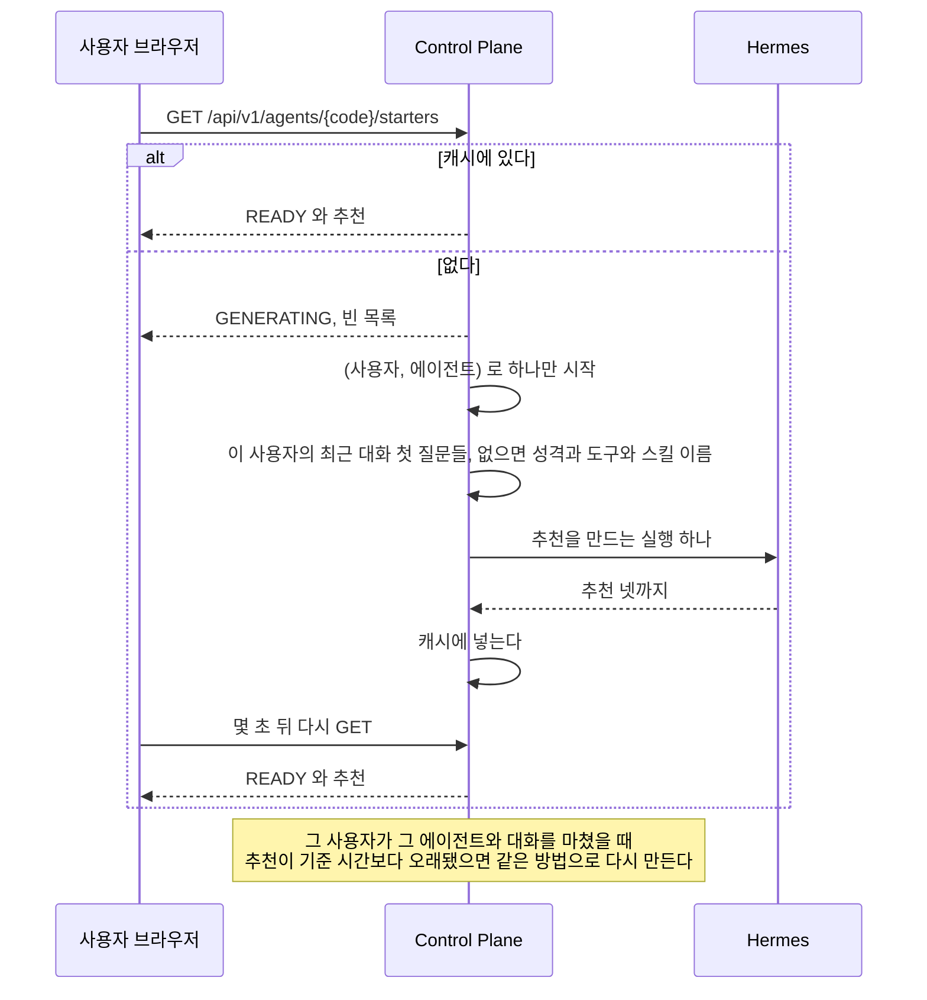
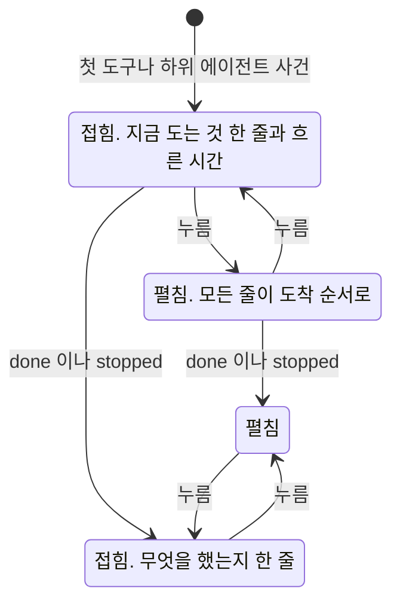

# web 화면이 보이는 것

화면마다 누구에게 무엇을 보이고 무엇을 그리지 않는지, 그 화면이 맞게 동작하는지 무엇으로 확인하는지를 갖는다.
화면 전환과 화면이 부르는 순서는 [`flow.md`](flow.md), 화면 목록과 틀, 부품 배치는 [`code-architecture.md`](code-architecture.md) 가 갖는다.
화면 코드를 쓰는 규칙과 검사 명령은 [`web/AGENTS.md`](../AGENTS.md) 가 갖는다.

## 관리자 영역

**관리자도 일반 화면에서는 `MEMBER` 역할 사용자와 같은 것을 본다.** 관리자 전용 표시와 관리 동작은 `/admin` 아래에만 있다.
근거는 [ADR-063](../../docs/adr/ADR-063-관리자-전용-표시와-동작은-관리자-영역에만-두고-일반-경로의-응답은-서버가-역할에-따라-줄인다.md) 이 갖는다.
틀과 입구, 돌아가는 길은 [`shell.md`](code-architecture.md) 의 「관리자 입구」 와 「관리자 영역의 틀」 절이 갖는다.

| 메뉴 | 경로 | 담는 것 | 일반 화면에서 옮겨 온 것 |
| --- | --- | --- | --- |
| 사용자 | `/admin/people` | 사용자 추가, 사용 중지와 다시 허용, 마지막 로그인과 마지막 대화 시각 | 사이드바 메뉴의 「사용자 관리」 링크 |
| 에이전트 | `/admin/agents`, `/admin/agents/{code}` | 다른 사람의 비공개와 꺼진 에이전트까지 든 목록, 운영 profile 등록, 에이전트의 기본 모델과 받는 기억 영역과 사용 여부와 연결 주소, 내 살펴보기의 가치 평가 | `/agents` 의 관리자 목록과 등록 양식, `/agents/{code}` 의 「모델」 과 「관리」 절 |
| 모델 | `/admin/models` | 그룹 모델 설정(단계별 모델, 그룹 기본 단계), 모델 숨김 | 대화 입력창 모델 선택기 안의 「그룹 모델 설정」 |
| 도구 | `/admin/tools` | 그룹의 화면에 보일 도구, 켜진 에이전트 수와 관리 화면 링크 | 없음 |
| 사용량과 비용 | `/admin/usage`, `/admin/executions/{id}` | 금액과 모델과 토큰, 「사용량 내역」, 「설정별 사용량」 탭, 실행 상세의 내부 값 | `/usage` 와 `/executions/{id}` 가 `ADMIN` 에게 더 그리던 것 |
| 커넥터 | `/admin/connections` | 반영을 기다리는 바인딩의 「반영 완료」. 재시작 대기 바인딩은 공유 gateway 를 재시작한 뒤 누른다 | `/connections` 아래의 관리자 패널 |
| 브라우저 | `/admin/browsers` | 모든 사용자 브라우저의 상태와 오류 코드, 끄기와 지우기 | 없음. `/browser` 는 내 브라우저만 보이고 오류 코드를 그리지 않는다 |

대화 화면도 같다. 작업 과정의 「원본 보기」, 모델이 바뀌었다는 표시, 오류 코드는 일반 화면에 그리지 않는다.
실패한 실행의 원인은 `/admin/usage` 의 실행 기록에서 그 실행을 열어 본다.

사용자 관리 목록은 「첫 로그인」 여부 대신 「마지막 로그인」과 「마지막 대화」를 보인다.
각 시각은 상대 시각과 서울의 정확한 시각을 함께 보이고, 값이 없으면 「기록 없음」이다.
행의 「상세」를 펼치면 이름, 이메일, profile, 첫 로그인 여부와 두 시각을 다시 확인한다.
로그인 이력은 기존 사용자 또는 마지막 로그인 기록이 있으면 있다고 보인다. 로그인 완료 직후에는 일반 요청으로 사용자가 아직 만들어지지 않았을 수 있다.
상세는 목록 응답을 사용하므로 사용자별 추가 요청은 없다. 두 시각은 `ADMIN`만 보는 이 화면에 둔다.

**일반 화면에 남긴 것.** 관리 작업이 아니라 쓰면서 하는 일이다.

| 남긴 것 | 까닭 |
| --- | --- |
| 내 기본 단계와 대화별 모델 선택 | 사용자 본인의 설정이다 |
| 내 에이전트 만들기, 성격과 도구와 스킬, 공개와 삭제 | 주인이 하는 일이다. `ADMIN` 이 그룹에 공개된 에이전트를 고칠 수 있는 것도 서버 권한 그대로 남는다 |
| 기억 화면의 그룹 공용 기억 고치기와 지우기 | 대화하다 생긴 것을 검토하는 자리다. 옮기면 기억 화면이 둘로 나뉜다. 서버가 `ADMIN` 에게만 허용한다 |

**화면이 관리자 표시를 그릴지는 `useAdminView()` 가 정한다.** 역할이 `ADMIN` 이고 지금 경로가 `/admin` 아래일 때만 참이다.
역할만 보고 그리면 일반 화면에 관리자 표시가 다시 생긴다.

**그룹 모델 설정은 에이전트 없이 읽는다.** `GET /api/v1/admin/model-tiers` 가 그룹에 저장된 단계 정의를 그대로 준다.
단계 정의는 그룹의 설정이고 특정 에이전트에 매이지 않는다. 에이전트로 읽는 `GET /api/v1/chat/model-tiers` 는 요청자가 대화를 시작할 수 있는 에이전트만 받는다.
관리자 목록의 첫 에이전트가 다른 사용자의 비공개 에이전트면 그 조회가 `AGENT_NOT_FOUND` 로 실패해 관리자가 그룹 단계를 고칠 곳이 없어진다.
에이전트로 읽으면 provider 를 비운 단계가 그 에이전트의 기본 provider 로 채워져 보이고, 그대로 저장하면 그 값으로 굳는 문제도 있었다.
저장할 때의 검사는 형식과 숨김뿐이라 에이전트의 모델 목록이 필요 없다. 모델이 그 에이전트의 목록에 있는지는 실행할 때 본다.

`/admin/models` 는 에이전트를 고르는 칸을 둔다. 그 칸은 「모델 숨김」 절이 보일 모델 목록을 정한다.
숨길 모델의 목록을 Hermes profile 에 물어 읽고, 그 목록이 에이전트마다 다르기 때문이다.
그룹 모델 설정과 숨김은 어느 에이전트를 골라도 그룹 전체에 걸린다.

### 화면에 보일 도구

`/admin/tools`에서 그룹 전체의 도구 목록을 정한다. 각 도구의 「보이기」 스위치를 누르면 바로 저장하고,
「보임」 또는 「숨김」과 「켜진 에이전트 N개」를 보인다. 에이전트 이름을 누르면 관리자 상세 화면으로 간다.
숨겨도 이미 켜진 도구는 계속 실행된다는 안내를 둔다. 관리자가 에이전트 상세에서 직접 끈다.
목록 조회 실패에는 다시 불러오기 단추와 안내를 보이며, 저장 실패에는 기존 스위치 상태를 유지한다.

일반 에이전트 도구 절은 숨긴 도구를 그리지 않는다. 관리자 상세의 도구 절에는 같은 항목에
「일반 화면에서 숨김」 배지를 붙여 보여 주고 기존 켜기와 끄기를 그대로 제공한다.
연결 절의 셸 위험과 스킬 비활성 안내는 숨김 목록과 별개인 실제 활성 여부로 판단한다.

## 에이전트 화면

일반 화면의 「에이전트」 는 내가 쓸 수 있는 에이전트를 보이고, 관리자 영역의 「에이전트」 는 그룹의 모든 에이전트를 보인다.
두 상세는 같은 부품을 쓰고, 관리자 영역의 상세에만 「모델」, 「기억 영역」, 「관리」 절이 더해진다.

| 자리 | 누구에게 | 무엇 |
| --- | --- | --- |
| 목록 | 모두 | 내가 쓸 수 있는 에이전트. 누르면 상세로 간다. 목록 위에 「새 에이전트」 가 있다. 이름과 공개 범위만 받는다 |
| 상세의 「대화하기」 | 일반 화면에서 내 목록에 든 에이전트. 관리자 영역과 옛 커넥터 에이전트에는 그리지 않는다 | 맨 위 오른쪽. `/?agent=<번호>` 로 그 에이전트를 고른 새 대화를 연다 |
| 관리자 영역의 목록 `/admin/agents` | `ADMIN` | 다른 사람의 비공개 에이전트와 꺼 둔 에이전트까지 보인다. 「다른 사람 것」, 「꺼짐」 표시를 붙인다. 운영에서 만든 profile 을 등록하는 양식이 있다. 줄을 누르면 `/admin/agents/{code}` 로 간다 |
| 상세의 성격 | 그 에이전트를 쓸 수 있는 사람. 고치는 것은 주인과 `ADMIN` | 읽기와 쓰기 권한은 [「페르소나」](../../docs/backend/agent.md#페르소나) 의 「누가 고칠 수 있나」 와 같다 |
| 상세의 도구 | 그 에이전트의 주인과 `ADMIN` | 도구의 켜짐을 보고, 주인은 주인 등급을, `ADMIN` 은 모든 등급을 바꾼다. 다른 사람의 비공개 에이전트는 관리자 영역의 상세에서 관리자 경로로 읽고 쓴다 |
| 상세의 스킬 | 그 에이전트를 쓸 수 있는 사람. 고치는 것은 주인과 `ADMIN` | 스킬마다 이름, 설명, 「올린 스킬」 이나 「Hermes 기본」 표시, 켜짐. 관리하는 사람에게는 켜고 끄기, 호출 수와 마지막 호출, 올린 스킬의 편집과 삭제, 「스킬 추가」. 아니면 `/이름` 으로 부를 수 있다는 안내 |
| 스킬 편집 `/agents/{code}/skills/{name}` | 주인과 `ADMIN` | `SKILL.md` 본문과 미리보기, 참고 파일 목록과 올리기. 별도 페이지다 |
| 상세의 이 에이전트가 쓰는 연결 | 그 에이전트의 주인. 관리자도 남의 에이전트에는 그리지 않는다. 옛 커넥터 에이전트에는 그리지 않는다 | 내 연결마다 이름, 도구 수, 상태(「붙음」, 「반영 대기」, 「붙지 않음」), 「붙이기」 와 「떼기」. 아래 「연결 절」 |
| 상세의 먼저 살펴보기 | 그 에이전트로 대화를 시작할 수 있는 사람. 옛 커넥터 에이전트에는 그리지 않는다 | 「지금 살펴보기」 단추, 할 수 없을 때의 까닭, 점검 대화로 가는 링크, 마지막 살펴보기의 시각과 결과. 아래 「먼저 살펴보기 절」 |
| 상세의 공개와 삭제 | 주인과 `ADMIN`. 옛 커넥터 에이전트는 주인에게 그린다 | 나만과 그룹 공개를 바꾸는 단추, 확인 창을 거치는 삭제. 옛 커넥터 에이전트는 삭제만 있다. 연결이 붙은 에이전트를 그룹 공개로 바꾸면 「연결이 붙은 에이전트는 그룹에 공개할 수 없어요. 연결을 뗀 뒤 다시 시도해 주세요.」 를 보인다 |
| 관리자 영역 상세의 가치 평가 절 | `ADMIN`. 그 에이전트로 대화를 시작할 수 있을 때 | 내가 연 마지막 살펴보기의 「이 살펴보기 평가하기」 단추와, 평가의 축별 선택과 행동 정책 판정. 결과를 고치거나 승인하지 않는다. 자동 실행이 켜진 설치에서는 판정이 읽기 전용 살펴보기를 시작할 수 있다. 아래 「가치 평가 절」 |
| 관리자 영역 상세의 모델 절 | `ADMIN` | 에이전트의 기본 모델과 경고, 모델 숨김 |
| 관리자 영역 상세의 기억 영역 절 | `ADMIN`. 옛 커넥터 에이전트에는 그리지 않는다 | 그룹의 영역마다 「받음」 과 「민감 항목까지」, 실릴 수 있는 항목 수와 빠진 영역 안내, 「기억 영역 저장」, 최근 변경. 아래 「기억 영역 절」 |
| 관리자 영역 상세의 관리 절 | `ADMIN` | 사용 여부, Hermes 주소, 「먼저 살펴보기에 쓰기 도구 허용」. 마지막 칸은 누르면 바로 저장되는 켜고 끄기이고, 켜져 있는 동안 「켜면 먼저 살펴보기가 셸, 파일, 브라우저, 외부 메시지 같은 관리자 도구를 써서, 웹 결과 속 글이 명령 실행이나 외부 연락으로 이어질 수 있어요」 를 경고로 보인다. 옛 커넥터 에이전트에는 그리지 않는다 |

### 기억 영역 절

`components/agent/agent-memory-section.tsx` 가 관리자 영역 상세의 「기억 영역」 을 그린다. 「모델」 절 뒤, 「관리」 절 앞에 둔다.
화면이 뜬 뒤 `GET /api/admin/agents/{code}/memory-collections` 를 읽는다. 읽지 못해도 다른 절은 그대로 쓴다.
API 와 수를 세는 규칙은 [`../backend/memory.md`](../../docs/backend/memory.md) 의 「관리자가 에이전트의 collection 을 바꿀 때」 가 갖는다.

| 때 | 보이는 것 |
| --- | --- |
| 읽었다 | 영역마다 이름, 「받음」 과 「민감 항목까지」 체크박스, 「항목 N개」. 「민감 항목까지」 는 받는 영역에서만 고른다. 받음을 끄면 함께 꺼진다 |
| 받지 않는 영역에 항목이 있다 | 그 줄에 「항목 N개가 있지만 받지 않아요.」 를 경고 색으로 보인다 |
| 받지만 민감 항목을 허용하지 않은 영역에 민감 항목이 있다 | 그 줄에 「민감 항목 N개는 받지 않아요.」 를 경고 색으로 보인다 |
| 그룹 목록에 없는 영역을 받고 있다 | 이름 자리에 key 를 보이고 「목록에 없는 영역」 배지를 단다 |
| 고른 영역이 하나도 없다 | 「받는 영역이 없으면 이 에이전트는 기억을 쓰지 않아요.」 를 경고로 보인다. 저장은 막지 않는다 |
| 수를 센 대상 | 주인이 있으면 「주인(<이름>)의 기억과 그룹 기억을 셌어요.」, 없으면 「주인이 없어 그룹 기억만 셌어요.」 |
| 「기억 영역 저장」 을 누른다 | 고른 전체를 보낸다. 바뀐 것이 없으면 단추가 꺼져 있다. 성공하면 응답으로 다시 그리고 「저장했어요.」 를 보인다. 실패하면 고른 값을 그대로 두고 오류를 보인다 |
| 최근 변경 | 시각, 바꾼 사람, 「<영역> 붙임」, 「<영역> 뗌」, 「<영역> 민감 항목 허용」, 「<영역> 민감 항목 허용 끔」. 민감 허용과 함께 붙였으면 「<영역> 붙임(민감 항목 허용)」. 없으면 「아직 바꾼 기록이 없어요.」 |

### 연결 절

`components/agent/agent-connections-section.tsx` 가 「이 에이전트가 쓰는 연결」 을 그린다. 도구 절 뒤, 스킬 절 앞에 둔다.
서버 컴포넌트가 주인일 때만 `GET /api/v1/agents/{code}/connections` 를 읽어 넘긴다. 읽지 못하면 절 안에 실패 문구만 그린다.
계정 연결은 이 절이 하지 않는다. 절 머리의 「외부 서비스 연결하기」 가 `/connections?agent=<번호>` 로 이 에이전트를 실어 연결 화면을 연다. 붙일 수 없는 에이전트(그룹 공개, 옛 커넥터 에이전트)에는 그 단추를 두지 않는다. 내 연결이 하나도 없으면 「아직 연결한 계정이 없어요. 서비스 계정을 연결하면 이 에이전트에 바로 붙일 수 있어요.」 를 보인다.

| 때 | 보이는 것 |
| --- | --- |
| 붙일 수 있다 | 연결마다 이름, 「도구 N개」, 상태 표시와 「붙이기」 나 「떼기」. 붙었고 바인딩이 `READY` 이며 재시작 대기가 아니면 「붙음」, 붙었지만 아니면 「반영 대기」 다 |
| 연결이 아직 준비되지 않았다 | 「붙이기」 가 없고 「서비스 연결에서 연결을 확인해 주세요.」 를 보인다 |
| 그룹에 공개된 에이전트다 | 「비공개 에이전트에만 붙일 수 있어요.」 를 보이고 「붙이기」 를 그리지 않는다. 이 화면에서 비공개로 되돌리면 다시 붙일 수 있다 |
| 「붙이기」 를 누른다 | 확인 창을 연다. 「이 에이전트가 이 연결의 도구를 직접 써요. 운영에서 격리를 적용하지 않은 에이전트는 터미널이나 파일 도구로 연결의 비밀값에 닿을 수 있어요.」 를 보이고, 셸, 파일, 코드 실행 도구가 켜져 있으면 「격리를 적용하지 않은 에이전트는 연결 도구의 승인 없이 그 서비스를 부를 수 있어요. 격리한 에이전트도 연결 도구로 읽은 내용을 인터넷으로 보낼 수 있어요.」 를 경고로 더한다. 실패하면 창이 남아 까닭을 보인다 |
| 커넥터에 스킬이 있는데 `skills` 도구가 꺼져 있다 | 「지침을 쓰려면 스킬 도구를 켜세요.」 를 보인다 |

도구 절과 이 절은 서로의 위험을 알린다. 연결이 붙은 에이전트에서 셸, 파일, 코드 실행 도구를 켜면 도구 절의 확인 창이 「격리를 적용하지 않은 에이전트는 붙은 연결의 비밀값을 이 도구로 읽고, 연결 도구의 승인 없이 그 서비스를 부를 수 있어요. 격리한 에이전트도 연결 도구로 읽은 내용을 인터넷으로 보낼 수 있어요.」 를 더한다.
화면은 그 에이전트의 profile 에 실행 공간 격리([ADR-086](../../docs/adr/ADR-086-셸과-파일-도구는-사용자별-docker-실행-공간에서만-돈다.md))가 적용됐는지 모른다. 그래서 두 경우를 함께 알린다.
「바인딩」 은 화면에 보이지 않는다. 「붙이기」, 「떼기」, 「이 에이전트가 쓰는 연결」, 「반영 대기」 라 쓴다.

**옛 커넥터 에이전트의 상세**는 성격 자리에 「예전 방식의 연결 에이전트예요. 쓰던 에이전트에 이 연결을 붙인 뒤 이 에이전트를 지워 주세요.」 를 보이고, 도구, 연결, 스킬, 먼저 살펴보기 절을 그리지 않는다. 공개와 삭제 절은 삭제만 남긴다.

**「외부 서비스 연결」 화면**은 계정 연결을 맡는다. 목록의 카드는 연결된 커넥터에 「붙인 에이전트 N개」 를 보이고, 지금 쓸 수 있는 커넥터가 연결됐는데 쓰는 에이전트가 없으면 「아직 쓰는 에이전트가 없어요. 눌러서 쓸 에이전트를 골라 주세요.」 를 보인다. 연결 하나의 화면은 「붙인 에이전트」 목록에 에이전트마다 상세로 가는 링크와 반영 대기 표시를 보인다. 떼기는 에이전트 화면에서 한다. 연결 확인이 `CONNECTOR_NOT_CONNECTED` 로 끝나면 「값을 다시 입력해 연결해 주세요.」 를 보이고, 서버가 연결을 준비 중으로 커밋하므로 연결을 다시 읽어 상태를 맞춘다.

관리자 패널은 바인딩마다 사용자, 커넥터, 에이전트 번호, 상태를 보이고, 재시작 대기 바인딩과 `PENDING` 바인딩에 「반영 완료」 를 둔다.
재시작 대기 바인딩은 「공유 gateway 를 재시작한 뒤 눌러 주세요.」 를 안내한다.
재시작이 필요 없는 `PENDING` 바인딩은 「반영 중」 으로 보이고 「몇 분이 지나도 남아 있으면 눌러 다시 확인해요.」 를 안내한다. Control Plane 이 스스로 반영을 확인하지만, 그 확인이 한 번 실패하면 바인딩이 `PENDING` 으로 남기 때문이다. 재시작한 뒤 다시 설치된 바인딩이면 서버의 거절 문구를 보이고, 성공하든 거절되든 목록을 다시 읽는다.

### 연결 뒤 에이전트 고르기

`components/connector/connector-agent-chooser.tsx` 가 연결 하나의 화면 맨 위에 그린다.
연결한 뒤 무엇을 할지 모르는 일이 없게, 연결을 마친 같은 자리에서 그 연결을 쓸 에이전트를 고르고 바로 붙인다.

| 보이는 때 | 제목 |
| --- | --- |
| 등록이나 「연결 다시 확인」 으로 연결이 처음 `READY` 가 됐다. 제목에 초점을 옮긴다 | 「<서비스> 연결이 끝났어요」 |
| 연결됐고 쓰는 에이전트가 없다. 또는 `?agent=<번호>` 의 에이전트에 아직 붙지 않았다 | 「이 서비스를 쓸 에이전트」 |
| 「붙인 에이전트」 의 「쓸 에이전트 고르기」 나 「다른 에이전트에도 붙이기」 를 눌렀다 | 같다 |

후보는 내 에이전트 가운데 옛 커넥터 에이전트를 뺀 것이다. 순서는 `?agent=` 의 에이전트(「방금 보던 에이전트예요.」), 붙일 수 있는 것, 이미 붙은 것(「이미 쓰고 있어요」), 그룹 공개 순서다.
그룹 공개 에이전트는 단추 대신 「그룹에 공개한 에이전트라 붙일 수 없어요. 나만 쓰는 에이전트로 바꾸면 붙일 수 있어요.」 를 보인다.
붙일 수 있는 에이전트가 없으면 에이전트를 만들면 바로 붙일 수 있다고 알리고 「에이전트 만들기」(`/agents?new=1`)를 둔다.
「나중에」 는 영역을 닫는다.

「이 에이전트에서 쓰기」 를 누르면 그 에이전트의 도구를 읽는다. 도구를 읽는 동안 단추는 「확인하는 중」 이다. 셸, 파일, 코드 실행 도구가 켜졌거나 도구를 읽지 못했으면 에이전트 화면과 같은 붙이기 확인 창을 셸 위험 경고와 함께 거친다. 아니면 바로 붙인다. 붙이기가 실패해도 서버에 바인딩이 남았을 수 있어 붙인 에이전트 목록을 다시 읽는다.
붙이면 「「<에이전트>」에 붙였어요」 와 「이제 「<에이전트>」 대화에서 「<서비스>」 도구를 써요.」 에 언제 쓸 수 있는지를 붙여 보이고(「바로 쓸 수 있어요.」, 「몇 분 안에 쓸 수 있어요.」, 재시작 대기는 「관리자가 반영을 확인하면 쓸 수 있어요.」), 「<에이전트>와 대화하기」 가 `/?agent=<번호>` 로 그 에이전트를 고른 새 대화를 연다. 붙인 에이전트 목록도 다시 읽는다.

목록 화면이 `?agent=<번호>` 로 열리면 「보던 에이전트에서 쓸 서비스를 골라 연결해 주세요.」 를 보이고, 카드 링크가 그 번호를 연결 하나의 화면으로 넘긴다.

### 먼저 살펴보기 절

`components/agent/agent-proactive-check-section.tsx` 가 그린다. 스킬 절 뒤, 관리자 절과 공개와 삭제 절 앞에 둔다.
서버 컴포넌트가 `GET /api/v1/agents/{code}/proactive-check` 를 읽어 넘긴다. 읽지 못하면 절 안에 실패 문구만 그린다.

| 상태 | 보이는 것 |
| --- | --- |
| 할 수 있다 | 한 줄 설명, 주 단추 「지금 살펴보기」, 점검 대화가 있으면 「점검 대화 열기」 링크, 마지막 살펴보기의 시각과 결과 한 줄 |
| 할 수 없다 | 단추를 끄고 까닭마다 할 일을 보인다. `TOOLSETS_NOT_ALLOWED` 는 끌 toolset 의 한국어 이름을 나열하고 위 도구 절에서 끄라고 안내한다. `SKILL_MISSING` 은 `proactive-check` 스킬을 설치하거나 켜야 한다고 안내한다 |
| 누른 뒤 | `POST /api/v1/agents/{code}/proactive-check/runs` 가 202 면 `/chat/{conversationId}` 로 간다 |
| 거절됐다 | `USER_BUSY`, `CONVERSATION_BUSY` 는 단추 아래에 끝난 뒤 다시 누르라는 안내를 보인다. `PROACTIVE_CHECK_UNAVAILABLE` 이면 절을 다시 읽어 까닭을 그린다 |

이 절의 끝에 「매일 깨우기」 소절(`agent-proactive-schedule-section.tsx`)을 그린다.
에이전트 상세에서는 상태 조회가 실패해도 실패 문구 아래에 그린다.
소절은 `GET /api/v1/agents/{code}/proactive-check/schedule` 을 읽어 켜기, 시각과 시간대, 막는 까닭, 다음 실행, 마지막 결과를 보이고, 「저장」 이 `PUT` 으로 저장한다([ADR-085](../../docs/adr/ADR-085-매일-깨우기는-예약-작업을-다시-쓰고-다섯-칸-보고를-지금-화면에-올린다.md)).
그 아래에 매일 루프 설정 「깨운 뒤 먼저 다룰 문제 고르기」 를 둔다. `GET/PUT /api/v1/agents/{code}/proactive-check/loop` 를 쓴다([`../backend/proactive-loop.md`](../../docs/backend/proactive-loop.md) 의 「사용자 설정」).

| 상태 | 보이는 것 |
| --- | --- |
| 설치가 열지 않았고 꺼져 있다(`available = false`, `enabled = false`) | 스위치를 눌리지 않게 막고 「이 설치에서는 아직 쓸 수 없어요.」 를 보인다 |
| 설치가 열지 않았고 켜져 있다(`available = false`, `enabled = true`) | 같은 안내를 보이되 스위치로 끌 수 있고, 쉬기 단추도 그대로 보인다 |
| 꺼져 있다 | 스위치와 한 줄 설명 「매일 깨우기가 찾은 문제 가운데 먼저 다룰 것을 골라 지금 화면에 보여요.」 |
| 켜져 있다 | 스위치, 「하루 쉬기」, 「일주일 쉬기」 단추. 쉬는 중이면 「<시각>까지 쉬어요」 와 「쉬기 끝내기」 |
| 배치 | 매일 깨우기 설정의 `form` 밖에 둔다. 저장은 스위치와 단추가 바로 보낸다 |
| 저장이 거절됐다 | 오류 코드의 문구를 `Notice` 로 보인다. `PROACTIVE_LOOP_UNAVAILABLE` 은 「이 설치에서는 아직 쓸 수 없어요.」 다 |

관리자 영역 상세(`/admin/agents/{code}`)에서는 상태 조회가 성공했을 때만 그린다. 남의 비공개 에이전트처럼 관리자가 대화를 시작할 수 없는 에이전트는 404 라 절을 그리지 않는다.

마지막 살펴보기의 결과는 「새로 알릴 것이 있었어요」, 「새로 알릴 것이 없었어요」, 「결과 형식이 맞지 않아 정리하지 못했어요」, 답이 비었을 때의 「답을 받지 못했어요」, 「멈췄어요」, 「끝내지 못했어요」, 돌고 있을 때의 「지금 살펴보는 중이에요」 가운데 하나다.
결과를 읽지 못한 두 구절은 점검 대화의 알림 줄과 같은 말이고, 상태 조회의 `lastCheck.invalidReason` 이 `EMPTY_ANSWER` 인지로 고른다. 까닭이 비었으면 형식 쪽 구절이다.
사용자에게 스킬을 부르라고 안내하지 않는다. 스킬은 에이전트를 준비하는 사람이 설치한다.

**`ADMIN` 이라도 다른 사람의 비공개 에이전트는 성격을 읽지 못한다.**
그 에이전트는 관리자 영역의 상세로만 연다. 공개와 삭제 절과 관리 절이 보이고, 성격 자리에는 주인만 볼 수 있다는 안내를 둔다.
일반 화면의 `/agents/{code}` 로 열면 `MEMBER` 역할 사용자와 같이 찾을 수 없다는 안내를 본다.
backend 의 읽기 기준(`AgentService.requireReadable`)은 바꾸지 않는다.
관리 절이 쓰는 `/api/v1/admin/agents` 경로들도 그대로다.

**에이전트 등록과 Hermes 주소 수정은 저장하기 전에 그 주소가 닿는지 본다.**
그 에이전트의 profile key 로 `/v1/capabilities` 를 부른다.
그 profile 의 key 가 없으면 `HERMES_PROFILE_KEY_MISSING`, 주소가 200 으로 답하지 않으면 `VALIDATION_FAILED` 로 거절하고 저장하지 않는다.
틀린 주소나 profile 로 저장하면 그 에이전트의 모든 대화가 실패하고, 화면에는 Hermes 에 닿지 못했다는 것만 보인다.
`AgentEndpointProbe` 가 이 확인을 한다.

### 가치 평가 절

`components/agent/agent-value-evaluation-section.tsx` 가 그린다. 관리자 영역 상세(`/admin/agents/{code}`)에서만 먼저 살펴보기 절 바로 뒤에 둔다. 일반 상세에는 그리지 않는다.
서버 컴포넌트가 `GET /api/v1/admin/agents/{code}/value-evaluation` 을 읽어 넘긴다. 먼저 살펴보기 절을 그리지 않는 에이전트와, 살펴보기 상태를 읽지 못한 에이전트에는 이 절도 그리지 않는다. 그 밖에 이 절의 조회가 실패하면 절 안에 실패 문구만 그린다.
응답의 모양과 고르는 살펴보기는 [`backend/value-evaluation.md`](../../docs/backend/value-evaluation.md) 의 「관리자 화면이 읽는 묶음」 이 갖는다.

가치 평가와 행동 정책은 요청자의 자료만 다룬다. 관리자도 다른 사용자의 살펴보기를 평가하지 못하므로, 이 절은 관리자 본인이 연 살펴보기만 보인다.

| 상태 | 보이는 것 |
| --- | --- |
| 고를 살펴보기가 없다 | 「받아들인 문제 후보가 있는 살펴보기가 없어요.」 단추는 그리지 않는다 |
| 살펴보기가 있다 | 끝난 시각, 받아들인 문제 후보 수, 주 단추 「이 살펴보기 평가하기」. 평가가 있으면 그 결과를 아래에 함께 보인다. 마지막 평가가 `RUNNING` 이면 단추를 끈다 |
| 누른 뒤 | 단추를 끄고 「평가하는 중이에요」 를 보인다. 웹의 `POST /api/admin/proactive-checks/{checkId}/value-evaluation-runs` 가 Control Plane 의 같은 이름 경로를 부르고, 그 응답으로 절을 바꾼다 |
| 평가가 있다 | 결과 상태 코드와 실패 코드, 비교 설명. 후보는 추천 순서대로 두고 순서에 없는 후보는 식별자 순서로 뒤에 붙인다. 후보마다 문제 글과 행동 종류, 부작용 힌트, 여섯 축의 선택과 확신과 설명, 종합 확신과 종합 설명, 행동 수준과 까닭 코드, 실행 상태. 판단과 판정은 후보 식별자로 잇는다. 판단이 없는 후보는 축 표 대신 「이 후보의 판단이 없어요.」, 판정이 없는 후보는 「판정이 없어요.」 를 보인다. 판정이 `EXECUTE` 면 실행 상태 배지가 붙는다 |
| 거절됐다 | 단추 아래에 오류 문구를 보인다. 절은 그대로 둔다 |

축 이름과 선택, 확신은 한국어로 보이고 표에 없는 값은 원래 값을 그대로 보인다. 결과 상태, 실패 코드, 행동 수준, 까닭 코드는 관리자 영역이므로 코드 그대로 보인다.
비교 설명과 축 설명은 모델이 쓴 글이므로 평문으로 그린다.
결과를 고치거나 승인하는 동작, 자동 실행 동의를 바꾸는 칸은 없다.
단추는 판정까지 부르므로, 설치 설정 `assistant.autonomy.execution-enabled` 와 관리자 본인의 동의가 모두 켜져 있으면 `EXECUTE` 판정이 읽기 전용 살펴보기를 한 번 시작할 수 있다. 절의 안내 문구가 이것을 알린다. 설치 기본값은 꺼짐이다.

## 사용량 화면의 탭

`/usage` 와 `/admin/usage` 는 같은 부품을 쓰고 탭으로 나눈다. `/usage` 는 셋, `/admin/usage` 는 넷이다. 고른 탭은 주소 `?tab=` 에 남아 새로 고쳐도 같은 탭이 열린다.

| 탭 | 담는 것 |
| --- | --- |
| 요약(`summary`, 기본) | 아래 표의 합계 칸과 「사용량 내역」 |
| 실행 기록(`executions`) | 아래 표의 「실행 기록」. 줄마다 그 실행에서 쓴 스킬 이름을 작게 붙인다 |
| 스킬(`skills`) | 내가 부른 스킬. 스킬마다 횟수와 마지막 호출, 누르면 그 대화로 간다. `GET /api/v1/usage/skills` 를 읽는다 |
| 설정별 사용량(`fingerprints`) | 아래 표의 「설정 차이」. `/admin/usage` 에만 있다 |

**금액과 모델과 토큰은 관리자 영역에만 그린다.** `/usage` 는 역할과 상관없이 요약 탭이 실행 건수만 보이고,
실행 기록은 에이전트 이름, 시각, 걸린 시간, 상태, 쓴 스킬 이름, 다시 보낸 실행 표시만 보인다. 걸린 시간은 초 단위이고 1초가 안 되면 「1초 미만」 이다. 「사용량 내역」 과 설정별 사용량 탭은 그리지 않는다.
실행 상세(`/executions/{id}`)의 머리 요약도 같은 규칙을 따르고, 실패 줄의 오류 코드는 `components/error-message.ts` 의 문구로 바꿔 보인다. 도구 줄의 원본은 `/admin/executions/{id}` 에서 「원본 보기」 를 펼칠 때만 보인다.
`/admin/usage` 의 실행 기록은 줄을 누르면 `/admin/executions/{id}` 로 간다.
실행 기록은 처음에 최근 루트 50개를 읽고 「더 보기」를 누를 때마다 다음 50개를 아래에 붙인다. 시작 시각과 번호의 역순이며 마지막 쪽에는 단추가 없다. 추가 조회 중에는 단추를 잠그고 「불러오는 중」을 보인다. 실패하면 이미 읽은 기록을 유지하고 안내와 재시도 단추를 보인다. 같은 실행은 한 번만 보인다. 휴대폰 카드와 넓은 화면의 표, 상세 화면의 작업 과정은 같은 기록을 쓴다.
`/usage`와 `/admin/usage`는 모두 자기 실행만 읽는다. 여러 사용자의 실행을 모아 보는 별도 화면은 없다.
에이전트 상세의 도구 이름과 설명은 `lib/toolset-label.ts` 가 한국어로 옮긴다. Hermes 가 준 영어 이름은 표에 없는 도구에만 그대로 쓴다.
**화면만 가리지 않는다. Control Plane 이 `MEMBER` 역할에게는 그 값을 응답에서 뺀다.**
빼는 값의 표는 [`backend/conversation.md`](../../docs/backend/conversation.md) 의 「역할에 따라 응답에서 빼는 값」 절이 갖는다.
`ADMIN` 은 일반 화면에서도 응답으로는 그 값을 받는다. 일반 화면이 그리지 않을 뿐이다.

### 탭 안의 절

절 이름은 화면에 보이는 제목이다.

| 절 | 보이는 것 | 그리지 않는 때 |
| --- | --- | --- |
| 제목 없는 합계 칸 | 실제로 나간 돈과 API 로 돌렸다면의 두 금액, 실행 수,<br>가격을 찾지 못한 실행 수 (있을 때만),<br>금액을 확인하지 못한 도우미 수 (있을 때만) | 합계를 불러오지 못했을 때 |
| 사용량 내역 | 에이전트, 모델, 날짜, 지문 네 축 중 고른 하나의 합계 | 첫 조회가 실패했을 때.<br>그 자리에 실패 문구만 그린다.<br>`/usage` 에는 절을 그리지 않는다 |
| 설정 차이 | 지문별 실행당 평균 비용 | 견줄 지문이 둘 미만일 때 |
| 첫 반응 시간 | 날짜와 모델 단계별 질문 수, 첫 반응과 제출까지와 첫 조각까지의 중앙값과 90번째 백분위. 세는 규칙은 [모델 단계와 실행 기록](../../docs/model-tiers.md) 의 「첫 반응 시간」 에 있다 | 조회가 실패했을 때.<br>그 자리에 실패 문구만 그린다.<br>`/usage` 에는 절을 그리지 않는다 |
| 먼저 알리기 | 최근 30일 동안 지금 화면에 보인 항목의 종류(`trigger`)별 보인 수, 숨김 비율, 미루기 비율, 행동 비율, 지금 표시의 헛보임, 첫 행동까지, 오래된 항목 비율. 비율은 분모가 0 이면 `-` 다. 세는 규칙은 [`../backend/attention.md`](../../docs/backend/attention.md) 의 「지표」 에 있다. 보인 항목이 없으면 「아직 지금 화면에 보인 항목이 없어요.」 를 그린다 | 조회가 실패했을 때.<br>그 자리에 실패 문구만 그린다.<br>`/usage` 에는 절을 그리지 않는다 |
| 실행 기록 | 실행 한 줄씩. `/admin/usage` 에서는 모델과 요청한 effort, 토큰과 문맥 글자 수와 두 금액까지 | 없다. 기록이 없으면 빈 상태를 그린다 |

화면은 하위 에이전트를 「도우미」 라고 부른다.
두 금액은 금액을 확인한 실행과 하위 에이전트만 합친 값이다.
「금액을 확인하지 못한 도우미」 칸은 `ADMIN` 에게만 그리고, 확인 중, 확인 실패, 가격 미확인 건수를 0 이 아닌 것만 나눠 적는다.
세는 규칙은 [모델 단계와 실행 기록](../../docs/model-tiers.md) 의 「합계와 완전성」 에 있다.
「사용량 내역」 의 줄은 하위 에이전트의 금액과 토큰을 포함한다. 하위 에이전트가 든 줄은 실행 건수 옆에 「도우미 N건」 을 작게 적는다.

위 표는 절 하나씩의 조건이다.
**실행 목록 조회가 실패하면 페이지 전체가 실패 문구 한 줄이 되고 위 절이 모두 함께 사라진다.**

**「사용량 내역」 은 그 달에 실행이 없어도 절과 축 고르는 단추를 그린다.**
표 자리에만 기록이 없다는 안내가 뜬다. 절이 통째로 사라지는 것은 첫 조회가 실패했을 때뿐이다.
그 둘을 같은 모양으로 그리면 읽는 사람이 쓴 것이 없는 것과 못 불러온 것을 구분하지 못한다.

**「설정 차이」 는 지금 한 번도 그려지지 않는다.**
`runtime_fingerprint` 를 채우는 경로가 없어 지문 축이 늘 빈 목록이기 때문이다.
결함이 아니라 값이 들어오기 시작할 때 고칠 곳이 없도록 먼저 만들어 둔 것이다.
그 칸을 왜 비워 두는지는 [`backend/schema/execution.md`](../../docs/backend/schema/execution.md) 의 「agent_execution」 절이 갖는다.

## 지금 화면

#161 의 Living View 를 이 저장소에서는 **지금 화면**이라 부른다. 주소, 카드의 배치, 이유 문구, 사용자 제어, 폭별 동작을 갖는다.
결정은 [ADR-074](adr/ADR-074-지금-화면은-원래-기록을-읽어-만든-view-이고-정해진-카드-넷만-그린다.md), 판정과 API 는 [`../backend/attention.md`](../../docs/backend/attention.md) 가 갖는다.

### 주소와 들어오는 길

| 자리 | 보이는 것 |
| --- | --- |
| `/now` | 지금 화면. 서버에서 `GET /api/v1/attention` 을 읽어 그린다. `loading.tsx` 를 둔다 |
| 사이드바 최상단, 「새 대화」 단추 바로 아래 | 「지금 볼 것」 링크. `nowCount` 가 0 보다 크면 그 수를 배지로 붙인다. 주요 화면 메뉴에는 넣지 않는다. 좁은 폭에서는 서랍으로 연 사이드바의 같은 자리다 |
| 새 대화 화면 `/` | 인사 아래 한 줄 「확인할 것 N건」. 누르면 `/now` 로 간다 |

**새 대화 화면의 한 줄은 홈을 그린 뒤에 채운다.** 브라우저가 `GET /api/v1/attention/summary` 를 부르고, 답이 오기 전에는 자리를 비워 둔다.
`nowCount` 가 0 이거나 부르기가 실패하면 그리지 않는다. 홈은 지금처럼 서버에서 읽는 것이 없고 `loading.tsx` 를 두지 않는다.
그 한 줄의 높이는 처음부터 잡아 둔다. 답이 온 뒤 줄이 생겨도 입력창이 밀리지 않게 하려는 것이다.
사이드바 배지도 같은 경로를 읽고, 기억 메뉴의 제안 건수처럼 화면을 옮길 때마다 다시 읽는다.
지금 화면 안의 제어나 할 일 동작이 성공하면 경로가 그대로여도 배지를 다시 읽는다.

**사이드바의 두 수를 헷갈리지 않게 둔다.** 「지금 볼 것」 링크의 수는 아직 남은 일 가운데 지금 볼 것이고, 링크 글자 오른쪽에 붙는다. 배지는 기억 제안 배지와 같은 muted 바탕이고 테두리가 없어 채운 바탕의 알림 배지와 모양이 다르다.
웹 알림(ADR-070)의 읽지 않은 수는 사이드바 맨 아래 밝기 단추 옆 알림 단추에 붙는다. 둘은 서로의 수를 더하거나 빼지 않는다.
「지금 볼 것」 링크의 접근성 이름은 `aria-label` 의 「지금 볼 것 N건」 이고, 0 이면 「지금 볼 것」 이다. 배지 자체는 낭독기에서 숨긴다. 알림 배지는 그쪽 문서가 정한다.

### 카드

| 열쇠 | 제목 | 비었을 때 |
| --- | --- | --- |
| `failures` | 실패 | 「실패한 일이 없어요」 |
| `needs_me` | 내 차례 | 「확인할 것이 없어요」 |
| `delegated` | 맡긴 일 | 「맡긴 일이 없어요」 |
| `continue` | 이어서 하기 | 「최근 대화가 없어요」 |
| `reports` | 보고 | 「새 보고가 없어요」 |

- 카드 순서는 응답의 순서를 그대로 따른다. 순서 규칙은 서버가 갖는다([ADR-074](adr/ADR-074-지금-화면은-원래-기록을-읽어-만든-view-이고-정해진-카드-넷만-그린다.md) 의 3번)
- 카드 머리에 제목과 그 카드의 `nowCount` 를 둔다. 0 이면 수를 그리지 않는다. 화면이 보이는 항목을 다시 세지 않는다. 사이드바의 수는 카드 `nowCount` 의 합이라 둘이 어긋나지 않는다
- 이 화면에서 `NOW` 항목을 숨기거나 미루면 카드 머리의 수가 그만큼 줄고, 되돌리면 다시 는다. 화면을 다시 읽지 않고 그린다. 숫자 배지는 낭독기에서 숨기고, 옆의 화면에 보이지 않는 글 「지금 볼 것 N건」 이 수를 읽어 준다. 제어는 카드가 항목 열쇠별로 한 곳에 갖고, 다시 읽은 응답에서 빠진 항목의 제어는 버린다
- 빈 카드는 머리와 비었을 때의 한 줄만 그린다. 다섯 카드가 모두 비면 카드 대신 `EmptyState` 하나로 「지금 확인할 것이 없어요」 를 그린다. 설명 문구는 「실패한 일, 내가 확인할 일, 맡긴 일이 생기면 여기에 보여요.」 다
- 다섯 카드가 모두 비어도 그 빈 화면 아래에 「할 일 더하기」 를 둔다. 「내 차례」 카드 끝의 것과 같은 `Dialog` 를 연다
- `status: UNAVAILABLE` 인 카드는 항목 대신 `Notice`(경고)로 「이 카드를 불러오지 못했어요. 잠시 뒤에 다시 열어 주세요」 를 그린다
- `moreCount` 가 있으면 카드 끝에 「N개 더 있어요」 를 그린다. 실패와 맡긴 일은 `/usage?tab=executions` 로 가는 링크이고, 내 차례와 이어서 하기는 링크 없이 글만 그린다. 내 차례는 승인 대기, 기억 제안, 할 일, 먼저 다룰 문제가 섞여 한 화면으로 보낼 곳이 없고, 이어서 하기의 나머지 대화는 사이드바 목록에 있다

부품은 `web/src/components/ui/` 의 `Card`, `CardHeader`, `CardTitle`, `CardAction`, `CardContent`, `Badge`, `EmptyState`, `Notice`, `DropdownMenu`, `Dialog` 를 쓴다.
실행의 상태 문구와 색은 `web/src/lib/execution-status.ts` 를 쓴다.

#### 보고 카드

매일 깨우기나 단추로 연 살펴보기의 보고를 원래 `proactive_check` 기록에서 읽는다.
항목마다 「무엇이 바뀌었나」, 「무엇을 했나」, 「근거」, 「남은 승인」, 「다음에 볼 것」을 그린다.
보고는 `LATER` 이므로 카드와 사이드바의 건수는 늘지 않는다.
실제 남은 승인은 기존 「내 차례」 카드에서 센다.
「보고 열기」를 누르면 요청자의 보고를 열었다고 기록한 뒤 점검 대화로 이동한다.
사이드바에서 점검 대화를 직접 열어도 그 대화의 보고가 열린 것으로 기록돼 다음에 읽을 때 카드가 사라진다.
글은 평문으로, 근거 링크는 서버가 검사한 원문 주소만 그린다.

### 항목 한 줄

| 자리 | 그리는 것 |
| --- | --- |
| 제목 | `title` 을 평문으로. 빈 대화 제목은 「새 대화」 로 그린다. 누르면 그 원래 기록으로 간다(`../backend/attention.md` 의 「카드의 단추와 승인 경계」) |
| 이유 | 아래 「이유 문구」 의 한 줄 |
| 출처 | 에이전트 이름, 할 일이면 「대화에서」(에이전트가 제안했다)나 「직접 더함」(사람이 더했다), 시각. 시각은 응답의 `readAt` 을 기준으로 1분 미만 「방금」, 「N분 전」, 「N시간 전」, 7일 미만 「N일 전」, 그 밖은 「9월 20일」 처럼 적고, `time` 요소의 `title` 로 전체 시각을 보인다 |
| `NOW` 표시 | `Badge` `warning` 으로 「지금」. 색과 글을 함께 쓴다 |
| 동작 | 항목 종류마다 아래 「동작」 |
| 제어 | 항목 오른쪽의 `DropdownMenu`(「이 항목 제어」). 숨기기, 내일 아침으로 미루기, 일주일 뒤로 미루기 |
| 문제 | 먼저 다룰 문제 항목만. 제목이 문제 글이고, 그 아래에 제안한 다음 행동(`problem.action`)을 평문으로 한 줄 그린다. `problem.level` 이 `ASK_APPROVAL` 이면 「직접 처리할 일이에요. 승인 요청이 아니에요.」 를 덧붙인다. 단추 아래에 「받아들임은 기록만 해요. 할 일이나 승인을 만들지 않아요.」 를 작게 보인다 |

할 일의 출처는 `followUp.agentProposed`로 정한다. 에이전트 제안을 받아들인 뒤에도 「대화에서」를 유지한다.
미수락 여부는 `followUp.proposed`이며, 상태별 이유와 단추는 `trigger`로 정한다.

### 이유 문구

| `trigger` | `signals` | 문구 |
| --- | --- | --- |
| `EXECUTION_FAILED` | `NOT_RETRIED` | 답을 만들지 못했고 아직 다시 보내지 않았어요 |
| `EXECUTION_FAILED` | 없음 | 답을 만들지 못했어요 |
| `DELIVERY_FAILED` | `DELIVERY_NOT_DONE` | 결과는 도착했는데 정리한 답을 만들지 못했어요 |
| `DELIVERY_FAILED` | 없음 | 결과를 정리한 답을 만들지 못했어요 |
| `APPROVAL_PENDING` | 없음 | 승인을 기다리고 있어요 |
| `APPROVAL_PENDING` | `EXPIRES_SOON` | 승인을 기다리고 있어요. 곧 만료돼요 |
| `MEMORY_PROPOSED` | 없음 | 에이전트가 기억할 것을 제안했어요 |
| `FOLLOW_UP_PROPOSED` | 없음 | 에이전트가 할 일로 제안했어요 |
| `FOLLOW_UP_OPEN` | `DUE_SOON` | 기한이 다가왔어요 |
| `FOLLOW_UP_OPEN` | `OVERDUE` | 기한이 지났어요 |
| `FOLLOW_UP_OPEN` | `LINKED_UPDATE` | 연결한 대화에 결과가 도착했어요 |
| `FOLLOW_UP_OPEN` | `WAITING` 만 | 기다리는 중이에요 |
| `FOLLOW_UP_OPEN` | 없음 | 챙기고 있는 할 일이에요 |
| `DELEGATION_RUNNING` | `LONG_RUNNING` | 맡긴 일이 오래 걸리고 있어요 |
| `DELEGATION_RUNNING` | 없음 | 맡긴 일이 진행 중이에요 |
| `DELEGATION_FINISHED` | 없음 | 맡긴 일이 끝났어요 |
| `CONVERSATION_RECENT` | 없음 | 최근에 나눈 대화예요 |
| `PROBLEM_SURFACED` | 없음 | 에이전트가 먼저 다룰 문제로 골랐어요 |
| `PROACTIVE_REPORT_TRIGGER` | 없음 | 새 보고가 있어요 |

`signals` 가 여럿이면 표의 위쪽 줄을 쓴다. 표에 없는 조합은 그 `trigger` 의 「없음」 줄을 쓴다.
모든 `trigger` 에 「없음」 줄이 있다. 관리자 지표 표의 종류 열도 이 「없음」 줄의 문구로 `trigger` 를 그린다.
모델이 쓴 글로 이유를 만들지 않는다.

### 동작

| 항목 | 단추 |
| --- | --- |
| 실패한 turn | 「대화 열기」 |
| 결과 전달 실패 | 「대화 열기」. 다시 전달은 그 대화의 알림 줄 아래 「결과 다시 전달」([`chat.md`](flow.md) 의 「결과 다시 전달」)이 한다 |
| 승인 대기 | 「대화에서 보기」 |
| Memory 제안 | 「기억에서 보기」 |
| 할 일 제안 | 「받아들이기」, 「거절」, 「고치기」 |
| 열린 할 일 | 「끝냄」, 「그만둠」, 「고치기」 |
| 맡긴 일 | 「작업 과정 보기」 |
| 먼저 다룰 문제 | 「점검 대화에서 보기」, 「받아들임」, 「관심 없음」 |
| 이어서 하기 | 제목을 누르면 대화가 열린다 |

「내 차례」 카드 끝에 「할 일 더하기」 를 둔다. 「고치기」 와 같은 `Dialog` 를 연다. 칸은 제목, 기한(날짜와 시각, 선택), 기다리는 중이다. 기한은 `Asia/Seoul` 의 날짜와 시각으로 넣는다. 「고치기」 에서 기한을 비우면 기한을 지운다.
기한 칸을 날짜와 시각으로 읽을 수 없으면 「기한을 날짜와 시각으로 넣어 주세요.」 를 보이고 저장하지 않는다.

먼저 다룰 문제의 「받아들임」 과 「관심 없음」 은 반응만 남긴다. 성공하면 그 항목이 사라지고 화면을 다시 읽는다. 판정이 이미 없다는 거절(`AUTONOMY_DECISION_NOT_FOUND`)이면 그 코드의 문구를 항목 아래에 보이고 화면을 다시 읽는다. 그 밖의 실패는 항목 아래에 「반응을 남기지 못했어요. 잠시 뒤 다시 눌러 주세요.」 를 보인다.

**항목의 제목이나 단추를 누르면 사건을 남긴다.** 원래 기록으로 가는 것은 `OPENED`, 받아들이기와 끝냄 같은 동작은 `ACTED` 다.
사건을 남기지 못해도 동작은 그대로 한다.

### 사용자 제어

- **숨기기**: 그 항목에 새 변화가 올 때까지 숨긴다. 누르면 그 줄이 「숨겼어요 · 되돌리기」 한 줄로 바뀌고, 화면을 다시 열면 사라진다. 「되돌리기」 는 `POST /api/v1/attention/restore` 다
- **미루기**: 「내일 아침」 은 다음 날 오전 9시(`Asia/Seoul`), 「일주일 뒤」 는 7일 뒤 같은 시각이다. 브라우저가 기한을 계산해 보낸다. 누르면 「미뤘어요 · 되돌리기」 한 줄로 바뀐다
- 제어는 원래 기록을 바꾸지 않는다. 숨긴 승인 대기도 그 대화의 승인 카드에는 그대로 있다
- 제어는 카드마다 따로 걸린다. 실패 카드에서 숨긴 대화가 이어서 하기 카드에 보일 수 있다
- 지금 화면에서 승인을 처리해도 웹 알림의 읽음 상태는 바뀌지 않는다
- 다른 동작으로 화면을 다시 읽으면 「되돌리기」 줄이 사라진다

### 폭별 배치

| 폭 | 배치 |
| --- | --- |
| `md` 이상 | 카드 두 열. 응답 순서대로 왼쪽 위부터 채운다 |
| `md` 미만 | 카드 한 열. 항목의 동작 단추는 줄 아래로 내려 손가락으로 누를 크기를 지킨다 |

바깥 틀은 `mx-auto max-w-4xl` 이다. `loading.tsx` 는 `PageSkeleton` 의 `cards` 모양과 같은 폭을 쓴다.

### 시나리오

모든 값은 지어낸 것이다.

**넓은 화면.** 어제 저녁 「주간 장보기 목록 정리」 대화의 답이 실패했고, 메일 초안 만들기 승인이 기다리고 있고, 조사 도우미에게 맡긴 일이 40분째 돈다.
사이드바 「지금 볼 것」 에 3 이 붙는다. `/now` 를 열면 실패 카드가 왼쪽 위, 내 차례 카드가 오른쪽 위, 맡긴 일 카드가 그 아래, 이어서 하기가 마지막이다.
사용자가 승인 대기 줄의 「대화에서 보기」 를 눌러 승인하고 돌아오면 내 차례 카드에서 그 줄이 사라지고 건수가 2 가 된다.

**좁은 화면.** 휴대폰에서 새 대화 화면을 연다. 인사와 에이전트 카드가 먼저 그려지고, 잠시 뒤 「확인할 것 2건」 한 줄이 나타난다.
그 줄을 누르면 `/now` 가 한 열로 열린다. 맨 위는 「장보기 예약 확인」 할 일이고 이유는 「기한이 다가왔어요」 다.
사용자가 제어 메뉴에서 「내일 아침」 으로 미루면 그 줄이 「미뤘어요 · 되돌리기」 로 바뀐다. 다음 날 9시 뒤에 열면 다시 보인다.

**제안을 받아들인다.** 대화 중에 에이전트가 「학교 상담 신청서 내기」 를 할 일로 제안했다.
지금 화면의 내 차례 카드에 「에이전트가 할 일로 제안했어요」 로 보이고 건수에는 세지 않는다.
「고치기」 로 기한을 금요일로 넣고 「받아들이기」 를 누르면 열린 할 일이 된다. 목요일부터 「기한이 다가왔어요」 로 건수에 센다.

## 기억 화면

`/memory` 는 에이전트가 대화하며 남긴 기억을 사람이 검토하고 고치고 지우는 화면이다.
사람이 손으로 기억을 만드는 자리는 지금 두지 않는다.
기억이 어떻게 저장되고 실행에 실리는지는 [`../backend/memory.md`](../../docs/backend/memory.md) 가 갖는다.

### 화면 구성

| 자리 | 무엇 |
| --- | --- |
| 「기억」 탭 | 맨 위 「검토할 기억」, 그 아래 「알고 있는 것」 목록 |
| 「문서」 탭 | 문서 목록. 문서를 읽지 못하면 탭이 없고 기억 목록만 보인다 |
| 맨 아래 접힌 절 | 「문서 읽기 토큰」. 펼치면 서비스 토큰을 관리한다 |

**목록의 줄은 제목과 짧은 표시만 보인다.** 본문은 줄을 눌러 펼쳤을 때만 보인다.
펼침은 그 자리에서 열리고 한 번에 한 줄만 열린다. 휴대폰과 데스크톱이 같은 동작을 하도록 옆 패널이나 주소 이동을 쓰지 않는다.

| 줄 | 제목 아래 표시 | 펼치면 |
| --- | --- | --- |
| 검토할 기억(`PROPOSED`) | 범위, 남긴 쪽, 바뀐 시각 | 본문, 「받아들이기」, 「거절」 |
| 알고 있는 것(`ACCEPTED`) | 범위, 남긴 쪽, 바뀐 시각, 「민감」, 「길어서 답에 포함되지 않음」 | 본문, 넣는 방식, 「고치기」, 「지우기」 |
| 문서 | 영역, 바뀐 시각, 「민감」 | 문서 이름과 판, 본문, 「고치기」, 「지우기」 |

- 범위는 「나에 대해」 와 「그룹」 으로 보인다.
- 「알고 있는 것」 은 바뀐 시각이 최근인 것부터 둔다. 「전체」, 「나에 대해」, 「그룹」, 「에이전트가 남김」 으로 거른다.
- 「고치기」 와 「지우기」 는 고칠 수 있는 사람에게만 보인다. 개인 기억은 주인, 그룹 기억은 `ADMIN` 이다.
- 민감한 기억은 목록이 본문을 싣지 않으므로 펼쳐도 본문 대신 안내만 보이고 「고치기」 가 없다. 서버도 그 수정을 거절한다.
- 「지우기」 는 확인 창을 한 번 거친다.
- 문서는 펼칠 때 본문을 받고, 접거나 다른 줄을 펼치면 받은 본문을 버린다.

### 남긴 쪽

에이전트가 남긴 기억(`proposedByExecutionId` 가 있는 줄)은 남긴 에이전트를 보인다.
대화의 「기억했어요」 로 바로 저장된 것과 제안을 받아들인 것이 모두 여기 든다.

| 응답 | 표시 |
| --- | --- |
| `proposedByExecutionId` 가 없다 | 직접 남김 |
| `sourceAgentDeleted` 가 참이다 | 지운 에이전트가 남김 |
| `sourceAgentName` 이 있다 | `<이름>이 남김` 또는 `<이름>가 남김`. 조사는 이름의 끝 글자로 고른다 |
| 그 밖 | 에이전트가 남김 |

이름을 보일지는 서버가 정한다. 읽는 사용자가 볼 수 없는 에이전트면 이름을 싣지 않는다.

### 숨긴 것과 되살리는 방법

| 숨긴 것 | 방법 | 되살리기 |
| --- | --- | --- |
| 「새 기억」 양식 | `web/src/lib/memory-features.ts` 의 `MEMORY_MANUAL_CREATE` 가 거짓이다 | 값을 `true` 로 바꾼다 |
| 「새 문서」 양식 | 같은 상수 | 같은 방법 |
| 「문서 읽기 토큰」 | 맨 아래 `<details>` 안에 접어 둔다 | 펼치면 그대로 쓴다 |

양식 컴포넌트와 API(`POST /api/v1/memories`, `POST /api/v1/memory-documents`)는 지우지 않았다.

이미 들인 기억의 `brain` 출처 기록과 그 표시는 유지한다.

## 대화 목록

사이드바의 목록은 최근에 고친 순서이고 날짜로 묶는다.
예약 작업이 만든 대화는 날짜 묶음에서 빼고 맨 위의 「예약 작업」 묶음 아래 작업 이름마다 접힌 줄로 모은다. 자세한 것은 [`../backend/task.md`](../../docs/backend/task.md) 의 「화면」 이다.

| 묶음 | 기준 |
| --- | --- |
| 오늘 | `updatedAt` 이 브라우저 시간으로 오늘 |
| 어제 | 어제 |
| 지난 7일 | 그보다 앞이고 7일 안 |
| 지난 30일 | 그보다 앞이고 30일 안 |
| 그 이전 | 나머지 |

제목이 빈 대화는 「새 대화」 로 보인다. 사진만 올리고 아직 보내지 않은 대화가 그렇다.

점검 대화(`purpose` 가 `CHECK`)는 제목 앞에 작은 「살펴보기」 배지를 붙여 일반 대화와 구분한다. 묶음과 순서는 일반 대화와 같다.

목록은 한 쪽(30개)을 읽고, 끝에 닿으면 다음 쪽을 읽는다.

검색은 제목을 브라우저에서 거른다. 아직 읽지 않은 쪽이 있으면 검색어를 쓰는 동안 남은 쪽을 쪽당 100개씩 모두 읽어 온 뒤 거른다.
빈 제목은 「새 대화」 로 보고 거른다. 메시지 본문은 찾지 않는다.

한 줄에 마우스를 올리면 메뉴 단추가 보인다. 좁은 화면에서는 늘 보인다. 메뉴는 이름 바꾸기와 지우기다.

```mermaid
flowchart TD
    A[이름 바꾸기] --> B[그 줄이 입력칸이 된다]
    B --> C{Enter 또는 바깥을 누름}
    C -- 빈 이름 --> D[원래 이름으로 되돌린다]
    C -- 이름 있음 --> E[PATCH /api/v1/chat/conversations/id]
    E -- 실패 --> D2[원래 이름으로 되돌리고 오류를 알린다]
    B -- Esc --> D
    F[지우기] --> G[확인 창]
    G -- 취소 --> H[아무것도 하지 않는다]
    G -- 지운다 --> I[DELETE /api/v1/chat/conversations/id]
    I -- 성공 --> J{지금 열린 대화인가}
    J -- 그렇다 --> K[/ 로 간다]
    J -- 아니다 --> L[목록에서 뺀다]
    I -- 실패 --> M[목록을 그대로 두고 오류를 알린다]
```

돌고 있는 대화도 지울 수 있다. 실행은 서버에서 끝까지 돌고 기록된다.
지운 대화에는 더 보낼 수 없다. 보내면 없는 대화와 같은 오류다.

## 기다리는 동안 보이는 것

기다림의 종류마다 다른 것을 보인다. 같은 회전 표시를 돌리지 않는다.

| 기다리는 것 | 보이는 것 |
| --- | --- |
| 대화 목록을 처음 읽는다 | 목록 자리에 뼈대 세 줄 |
| 고른 대화의 메시지를 읽는다 | 메시지 자리에 뼈대 두 줄 |
| 첫 사건을 기다린다 | 비서 이름 아래 답이 들어올 자리에 점 세 개가 차례로 밝아진다 |
| 도구나 하위 에이전트가 돈다 | 같은 자리의 작업 과정 블록이 지금 도는 것 한 줄과 흐른 시간을 보인다 |
| 답이 흘러나온다 | 글자가 그대로 쌓인다. 작업 과정 블록은 접힌 채 답 위에 남는다 |
| 다른 화면으로 옮긴다 | 누르는 즉시 그 화면 모양의 뼈대가 본문 자리를 채운다. 사이드바의 누른 줄 끝에 작은 회전 표시가 붙는다. 들어오는 본문은 200ms 동안 8px 오르며 나타난다. 대화 화면끼리 오갈 때는 움직이지 않는다 |
| 단추로 요청을 보냈다 | 그 단추 안에 회전 표시와 「저장 중」 처럼 지금 하는 일을 적는다. 단추 폭은 그대로다 |

뼈대는 실제 내용과 같은 높이로 둔다.
높이가 다르면 내용이 도착할 때 화면이 튄다.

**기다림 점, 작업 과정 블록, 답 본문은 같은 줄의 같은 자리에 차례로 들어온다.**
비서 얼굴과 이름이 먼저 자리를 잡고, 그 아래 칸의 내용만 바뀐다. 기다림 줄이 사라지고 답 줄이 새로 생기면 높이가 튄다.
움직임의 길이와 줄인 움직임 설정은 [ADR-051](adr/ADR-051-화면-색은-새벽-보라로-바꾸고-강조-색은-누를-것과-고른-것과-초점에만-쓴다.md) 이 정한다.

**화면을 옮길 때 이전 화면을 그대로 두지 않는다.**
화면마다 서버가 데이터를 다 읽은 뒤에 그리므로, 뼈대가 없으면 읽는 동안 이전 화면이 멈춘 채 남는다.
그러면 누른 것이 먹혔는지 알 수 없다. 그래서 서버가 데이터를 읽는 화면 경로에 `loading.tsx` 를 둔다.
사이드바의 표시는 Next 의 `useLinkStatus` 가 그 링크의 이동이 끝나지 않았다고 알려 주는 동안만 보인다.

**요청을 보내는 단추를 흐리게만 하지 않는다.**
흐린 단추는 「지금 보내는 중」 과 「지금은 누를 수 없음」 을 가리지 못한다.
보내는 동안에는 회전 표시와 지금 하는 일을 보이고 `aria-busy` 를 켠다. 두 번 누르지 못하게 잠그는 것은 그대로다.

답이 흘러나오는 동안에는 회전 표시를 따로 두지 않는다.
글자가 늘어나는 것 자체가 진행이고, 그 옆에 회전 표시를 함께 두면 둘 중 무엇을 봐야 할지 모른다.

흐름이 2분을 넘기면 한 번만 알린다.
이 화면을 떠나도 실행은 계속 돌고, 다시 열면 저장된 답이 보인다는 것이다.

## 새 대화 화면

`/` 에서 보이는 것이다. 입력창이 화면 가운데에 있고 첫 메시지를 보내면 아래로 내려간다.

```
            {이름}님, 무엇을 도와줄까요

   ┌ 가계부 비서 ┐ ┌ 여행 비서 ┐ ┌ 코딩 비서 ┐
   └────────────┘ └──────────┘ └──────────┘

   ┌───────────────────────────────────┐
   │ @ 로 에이전트를 부른다            ↑ │
   └───────────────────────────────────┘
   [기본 ⌄]
      [이번 달 지출 정리해 줘] [다음 주 식단 짜 줘]
```

| 무엇 | 동작 |
| --- | --- |
| 인사 아래 「확인할 것 N건」 | 지금 볼 것이 있으면 그 수를 한 줄로 보인다. 누르면 `/now` 로 간다. 0 건이거나 읽지 못하면 그리지 않는다. [`now.md`](prd.md) 의 「주소와 들어오는 길」 |
| 에이전트 카드 | 누르면 그 에이전트를 고른다. 처음에는 목록의 첫 에이전트가 골라져 있다. 주소가 `/?agent=<번호>` 이고 그 에이전트가 목록에 있으면 그 에이전트가 골라져 있다. 에이전트 상세의 「대화하기」 와 연결 화면의 「<에이전트>와 대화하기」 가 이 주소로 연다 |
| 추천 질문 | 고른 에이전트에서 이 사용자가 자주 하는 일. 모델이 만든다. 누르면 그 글로 바로 보낸다 |
| 입력창의 `/` | 맨 앞에 치면 고른 에이전트의 스킬 목록이 뜬다. [`backend/skill.md`](../../docs/backend/skill.md) 의 「스킬 커맨드로 보낼 때」 |
| 입력창의 `@` | 에이전트 목록이 뜨고 이름으로 거른다. 고르면 그 에이전트를 고르고 `@이름` 은 입력창에서 빠진다 |
| 첫 메시지 | 보내면 그 에이전트로 대화가 시작되고 에이전트는 그 대화에서 바뀌지 않는다 |
| 입력창 아래 모델 단추 | 누르면 모델과 effort 를 고르는 창이 뜬다. 처음에는 「기본」 이고, 고르면 빈 대화를 먼저 만들어 거기에 저장한다 |

**사진을 먼저 올려 빈 대화가 생기면 에이전트 카드와 `@` 가 잠긴다.** 그 대화의 에이전트가 이미 정해졌다.
모델을 먼저 고를 때도 같다. 고른 값을 저장할 대화가 있어야 해서 빈 대화를 먼저 만든다.
화면은 메시지가 없는 동안 새 대화 화면 모양을 그대로 쓴다.
흐름이 붙은 에이전트는 사진을 받지 않는다. 그 에이전트를 고르면 사진 단추가 없다.
옛 커넥터 에이전트는 그 커넥터의 `connector.json` 이 `attachments` 를 참으로 선언했을 때만 받는다([`connectors.md`](../../docs/connectors.md)). 연결을 붙인 일반 에이전트는 붙인 커넥터와 상관없이 다른 일반 에이전트와 같다.

**`@` 는 새 대화 화면에서만 뜬다.**
대화의 에이전트는 첫 메시지가 정하고 바뀌지 않는다. 중간에 다른 에이전트를 부르는 것은 에이전트가 정한다.

| 상황 | 화면 |
| --- | --- |
| 쓸 수 있는 에이전트가 없다 | 카드 자리에 「아직 쓸 수 있는 에이전트가 없어요. 에이전트를 만들면 바로 대화할 수 있어요.」 와 「에이전트 만들기」 를 보인다. 사용자는 자기 에이전트를 직접 만들 수 있으므로 관리자에게 미루지 않는다. 「에이전트 만들기」 는 `/agents?new=1` 로 가 「새 에이전트」 창을 연다. 입력창을 잠근다 |
| 에이전트가 하나다 | 카드를 그리지 않는다. 그 에이전트의 추천 질문만 |
| 추천을 만드는 중이다 | 그 자리를 비워 두고 2초 간격으로 세 번까지 다시 읽는다. 그래도 만드는 중이면 비워 둔다 |
| 추천을 만들지 못했다 | 그 자리를 비운다 |
| `@` 뒤 글자에 맞는 에이전트가 없다 | 목록에 맞는 에이전트가 없다는 한 줄 |

추천 질문은 사람이 고치지 않는다. 만드는 때와 규칙은 [`backend/agent.md`](../../docs/backend/agent.md#추천-질문) 가 갖는다.

### 추천을 만들 때



| 무엇 | 어떻게 되나 |
| --- | --- |
| 같은 키로 두 요청이 거의 함께 온다 | 만들기는 하나만 돈다. 둘 다 `GENERATING` 을 받는다 |
| 만들기가 실패하거나 Hermes 가 멈춰 있다 | 이전 추천을 그대로 둔다. 없으면 `NONE` 이고 화면은 자리를 비운다 |
| 재시작했다 | 캐시가 비어 첫 화면이 다시 만든다 |
| 그룹 공개 에이전트다 | 그 사용자의 대화만 읽는다 |

## 이번에 연 원문

저장된 비서 답 아래에 「이번에 연 원문」을 표시한다. 답을 저장한 직후와 이력을 다시 열 때 같은 서버 요약을 쓴다.
주소는 새 탭으로 열며 제목이나 열람 주장은 답 본문에서 가져오지 않는다.
「열람 도구 완료 N회 · 확인한 주소 M개」의 주소 수는 결과에서 확인한 URL만 센다.
`urls`는 「원문 결과에서 확인한 주소」, `requestedUrls`는 「열람 요청 · 도구 호출 성공」으로 나눠 표시한다.
후자에는 「페이지별 성공은 확인하지 못했어요.」를 붙인다. 시작 preview에 남은 첫 요청 주소만 보이므로 전체 요청 목록이 아니다.
두 목록 모두 비면 「기록에서 확인한 원문 주소가 없어요.」를 표시한다. 이 문구는 원문을 열지 않았다는 판정이 아니다.
결과가 잘리거나 가려져 주소를 확인하지 못했으면 그 사실을, 사건 관측이 불완전하면 「열람 기록을 모두 확인하지 못했어요.」를 함께 표시한다.
응답 중인 임시 답에는 표시하지 않는다. 사용자 메시지와 알림 줄에도 붙이지 않는다.

## 동작을 승인할 때

에이전트가 커넥터의 쓰기 도구를 부르면 Control Plane 이 승인 줄을 남기고, 화면은 입력창 바로 위의 승인 영역에 그 줄을 카드로 그린다.
승인 줄의 계약은 [`../connectors.md`](../../docs/connectors.md) 의 「승인」 이 갖는다.

**승인 영역은 화면 높이의 40% 까지만 차지하고 안에서 스크롤한다.**
카드를 메시지 흐름 안에 넣지 않은 것은, 승인 줄이 특정 답에 묶이지 않고 대화 전체의 기다리는 일이기 때문이다.
메시지 목록을 위로 올려 읽는 동안에도 기다리는 승인이 입력창 위에 남아 있어야 놓치지 않는다.
대신 높이를 제한해, 카드가 많아도 메시지 목록이 남은 자리에서 스크롤된다.

| 상황 | 화면 |
| --- | --- |
| 같은 커넥터의 같은 도구로 기다리는 줄이 둘 이상 | 한 묶음으로 보인다. 묶음 머리에 도구 이름과 위험도, 건수가 있다. 처음에는 접혀 있고 건마다 위에 보이는 첫 인자의 값을 쉼표로 이어 보인다 |
| 묶음을 펼쳤을 때 | 건마다 인자와 「승인」, 「거절」 이 있다. 한 건을 처리해도 묶음은 펼친 채 남는다. 한 건만 남으면 한 장의 카드가 된다 |
| 펼친 묶음의 모든 건이 한 번에 승인할 수 있는 줄 | 「N건 모두 승인」 이 보인다. 조건은 [ADR-087](adr/ADR-087-같은-도구의-승인-줄은-묶음으로-보이고-상시-허락을-줄-수-있는-줄만-한꺼번에-승인한다.md) 이 갖는다 |
| 실행 중이거나 실행했는지 모르는 줄, 도구 이름(`toolName`)이 없는 줄 | 묶지 않고 한 장씩 둔다. 이름이 없는 줄을 제목으로 묶으면 다른 도구가 섞일 수 있다 |
| 값이 빈 인자(`null`, 빈 글, 빈 배열, 빈 객체) | 값 대신 「비어 있는 항목」 한 줄에 이름만 모은다 |
| 상시 허락을 줄 수 있는 줄 | 값이 한 줄로 짧은(80자 이하) 인자를 앞에서부터 둘까지 위에 보이고, 나머지와 빈 인자의 이름은 「자세히」 에 접는다. 그런 인자가 없으면 모두 위에 보인다 |
| 상시 허락을 닫은 줄 | 접지 않는다. 값이 있는 인자를 모두 펼치고 빈 인자의 이름도 그 아래에 보인다([ADR-065](../../docs/adr/ADR-065-외부로-나가는-도구는-상시-허락을-닫는-선언을-둔다.md)) |

인자의 키는 원래 이름 그대로 보인다. 커넥터 선언(`connector.json`)에 인자의 표시 이름이나 중요도가 없기 때문이다.
어느 인자를 위에 둘지는 위 규칙으로 화면이 정하고, 값은 `web/src/lib/connector-action.ts` 의 `approvalArgs` 가 갖는다.

## 메시지 동작

| 어디 | 동작 |
| --- | --- |
| 모든 답 | 복사. 마크다운 원문을 복사한다 |
| 마지막 답 | 위에 더해 다시 생성 |
| 코드 블록 | 오른쪽 위의 복사 |

넓은 화면에서는 마지막 답의 동작을 늘 보이고 나머지는 마우스를 올리거나 초점이 갈 때 보인다.
좁은 화면에서는 늘 보인다. 마우스를 올릴 수 없기 때문이다.
복사하면 단추가 잠깐 「복사됨」 으로 바뀐다. 복사하지 못하면 복사하지 못했다는 문구로 바뀐다.

## 참고한 기억

답을 만든 실행이 본문을 받은 기억을 그 답 아래에 접어 둔다. 무엇을 모으는지는 [`backend/memory.md`](../../docs/backend/memory.md) 의 「답마다 참고한 기억」 이 갖는다.

대화를 열면 `GET /api/v1/chat/conversations/{id}/memory-uses` 를 읽어, 답의 실행 번호가 같은 줄을 그 답 아래에 둔다.
「기억했어요」 줄과 같은 때에 다시 읽는다. turn 이 끝나거나 답이 새로 저장될 때와, 「기억했어요」 줄에서 되돌리거나 고치거나 받아들였을 때다. 읽지 못하면 앞 목록을 그대로 두고 대화를 막지 않는다.
새로 나타난 접힌 줄은 맨 아래 따라가기가 보는 글의 변화에 든다. 펼치고 접는 것은 사용자가 한 일이라 따라가기를 바꾸지 않는다.

| 때 | 그리는 것 |
| --- | --- |
| 그 답에 줄이 없다 | 아무것도 그리지 않는다 |
| 접힘(처음) | 「참고한 기억 N개」 단추 하나. `aria-expanded` 가 거짓이다 |
| 펼침 | 항목마다 제목과 출처 표시. 출처는 `ALWAYS` 면 「항상」, `FACTS` 면 「기억한 사실」, `READ` 면 「찾아 읽음」. 그룹 항목은 「그룹」 을 덧붙인다. 목록 끝에 「기억 화면에서 고치기」 링크(`/memory`) |

제목은 평문으로만 그린다(ADR-009).
「쓴」 이 아니라 「참고한」 이다. 실렸어도 답에 쓰지 않은 항목이 섞인다([ADR-20261008 / memory-facts](../../docs/adr/ADR-20261008-memory-facts.md)).

## 작업 과정 블록

에이전트가 답을 만드는 동안 무엇을 했는지를 답 위의 블록 하나로 보인다.
ChatGPT 가 생각하는 과정을 접어 두는 것과 같은 자리다.

```
비서
┌ ✓ 찾아보고 도우미와 함께 정리했어요 ▾ ──────────────────┐
│  ✓ 검색했어요         제주 3월 날씨               2초    │
│  ⟳ 도우미             숙소 후보를 조사한다                │
│                              걸린 시간 1분 12초 · 자세히 보기 │
└────────────────────────────────────────────────────────┘
(답 본문)
```

**접힌 블록은 사람 말 한 줄이다.** 도구 수, 하위 에이전트 수, 모델 이름, 토큰 수를 대화에 그리지 않는다.
대화는 일반 사용자가 읽는 자리이고, 그 값은 관리자 영역의 사용량 화면이 보인다.
화면은 하위 에이전트를 「도우미」 라고 부른다.

| 접힌 블록의 상태 | 한 줄 |
| --- | --- |
| 도는 중 | 일하는 중 점, 지금 도는 줄의 말, 흐른 시간 |
| 끝남, 도구와 하위 에이전트를 모두 썼다 | 찾아보고 도우미와 함께 정리했어요 |
| 끝남, 하위 에이전트만 썼다 | 도우미와 함께 정리했어요 |
| 끝남, 도구만 썼다 | 필요한 것을 확인하고 답했어요 |
| 끝남, 흐름의 단계만 있다 | 차례로 정리했어요 |
| 사용자가 중지했다 | 하다가 멈췄어요 |
| 오류로 끝났다 | 끝까지 하지 못했어요 |

블록은 진행 중과 끝난 뒤에 같은 자리에 있다. 비서 이름 아래, 답 본문 위다.

블록은 사건이 하나라도 온 답에만 생긴다. 도구도 하위 에이전트도 쓰지 않은 답에는 없다.

| 무엇 | 한 줄 |
| --- | --- |
| 도구 | 아래 「도구를 보이는 말」 의 규칙으로 옮긴 문장, 끝났으면 걸린 시간. 실패면 오류 색 아이콘과 「실패」. `detail` 은 검색어와 사진 질문만 줄에 보인다. 그 밖의 `detail` 과 도구 이름 원문은 관리자 영역의 실행 상세에서 「원본 보기」 를 펼칠 때만 보인다 |
| 하위 에이전트 | 「도우미」 와 목표, 끝났으면 걸린 시간. 모델과 토큰은 그리지 않는다 |
| 흐름의 단계 | 단계 이름. 알려진 이름은 한국어로, 모르는 이름은 받은 그대로 |
| provider 전환 | 대화의 작업 과정에는 그리지 않는다. 예전 실행에만 있는 사건이고, 관리자 영역의 실행 상세(`/admin/executions/{id}`)가 실행 트리의 한 줄로 보인다 |

| 하위 에이전트 상태 | 뜻 |
| --- | --- |
| 도는 중 | 답이 진행 중이고 자식 완료 사건을 아직 받지 않았다 |
| 끝남 / 실패 | 자식 완료 사건이나 자식 실행의 종료 기록을 받았다 |
| 결과를 받지 못함 | 답이 끝났지만 자식 완료 사건을 받지 못했다. 자식이 실제로 끝났는지는 알 수 없다 |
| 중지됨 | 사용자가 답을 중지했거나 자식 실행에 취소 기록이 있다. 이미 끝난 자식은 종료 상태를 유지한다 |

걸린 시간은 초 단위로 보인다. 1초가 안 되는 시간은 그리지 않는다.
Hermes 최상위 위임은 부모보다 늦게 끝날 수 있어 부모 스트림이 닫힌 것만으로 중지를 판정하지 않는다.
하위 에이전트 이름이 없으면 목표를, 목표도 없으면 `preview` 를 80자 이내로 줄여 보인다.
둘 다 없으면 「도우미」 로 보인다. 실행 트리도 같은 이름 표시를 쓴다.

단계는 도착한 순서로 그린다. 아직 오지 않은 단계는 그리지 않는다. 이름과 차례를 화면에 박아 두지 않는다.
무엇을 나눌지는 Hermes 가 정하므로 단계가 바뀔 때마다 화면을 고치지 않게 한다.
근거는 [ADR-017](../../docs/adr/ADR-017-무엇을-할지는-hermes-가-정하고-control-plane-은-경계만-갖는다.md) 에 있다.

**`started` 와 `completed` 는 한 줄로 합친다.** 도구는 도착한 순서로 짝짓고,
하위 에이전트는 `subagentId` 가 있으면 그것으로, 없으면 도착한 순서로 짝짓는다.



**오류로 끝난 turn 도 블록을 지우지 않는다.** 그 화면에서는 그때까지 온 줄과 실패한 줄을 남긴 채 접힌 요약으로 바뀌고, 그 아래에 오류가 보인다.
완료 사건이 없는 하위 에이전트는 「결과를 받지 못함」 으로, 나머지 끝나지 않은 줄은 네모 아이콘으로 보이고 낭독기에는 「끝나지 않음」 으로 읽힌다.
새로 고치면 저장된 답이 없어 블록도 없다. 그 실행의 기록은 사용량 화면의 트리에서 본다.

### 도구를 보이는 말

도구 이름을 그대로 보이지 않고 사람 말로 옮긴다. 도는 줄과 끝난 줄의 말이 다르다.
도는 중인 접힌 블록의 한 줄에도 도는 줄의 말을 쓴다. 실행 트리의 도구 줄은 끝난 줄의 말을 쓴다.

문구는 `web/src/lib/tool-label.ts` 가 갖는다. 그 파일의 표에 없는 도구는 아래처럼 보인다.

- 표에 없는 MCP 도구(`mcp__` 로 시작한다)는 연결된 서비스를 쓴다고만 알린다. 도구 이름 원문을 보이지 않는다
- 그 밖의 표에 없는 도구와 이름이 없는 도구는 도구를 쓴다고만 알린다

MCP 도구는 `mcp__{서버}__{도구}` 로 오므로 마지막 `__` 뒤의 이름으로 표를 찾는다.

**`detail` 은 관리자만 모든 도구에서 받는다.** 사용자에게는 `web_search` 의 검색어와 `vision_analyze` 의 질문만 온다.
Control Plane 이 응답에서 뺀다. 화면도 받은 것을 그대로 그리지 않는다. 명령과 도구 결과의 원본은 JSON 이나 내부 경로라, 관리자 영역의 실행 상세(`/admin/executions/{id}`)에서만 접어 두고 펼칠 때 보인다. 대화 화면의 작업 과정에는 관리자에게도 그리지 않는다. 근거는 [ADR-038](../../docs/adr/ADR-038-도구의-명령-원문은-관리자에게만-보내고-사용자에게는-사람-말로-보인다.md) 에 있다.
사용량 화면의 실행 트리도 같은 응답을 쓴다.

### 펼친 목록의 높이

펼친 블록의 목록은 높이 상한 안에서 스크롤한다. 도구를 수십 번 부른 답에서 목록이 대화를 밀어내지 않게 한다.
상한은 `16rem` 이다. 좁은 폭과 넓은 폭이 같다.

| 상황 | 목록 |
| --- | --- |
| 도는 중이고 사용자가 맨 아래를 보고 있다 | 새 줄이 오면 맨 아래로 따라간다 |
| 도는 중이고 사용자가 위로 올려 읽고 있다 | 따라가지 않는다. 사용자가 맨 아래로 다시 내리면 그때부터 따라간다 |
| 끝난 답을 펼친다 | 맨 위부터 보인다. 따라가지 않는다 |

맨 아래에서 `16px` 안이면 맨 아래를 보고 있는 것으로 본다.
작업 과정 패널은 이미 제 높이 안에서 스크롤하므로 바꾸지 않는다.

### 끝난 답에서 다시 볼 때

메시지 조회가 답마다 작업 과정의 요약을 함께 준다. 도구 수, 하위 에이전트 수, 걸린 시간이다.
블록은 그 요약으로 접힌 채 그린다. 수는 접힌 한 줄의 문장을 고르는 데만 쓰고 그리지 않는다. 걸린 시간은 펼친 블록 아래에 보인다. 1초가 안 되면 그리지 않는다.
**펼칠 때 처음으로 실행 트리를 읽는다.** 답이 여럿인 대화를 열 때마다 트리를 모두 읽지 않기 위해서다.

| 상황 | 블록 |
| --- | --- |
| 사건이 없는 답 | 블록을 그리지 않는다 |
| 한 번에 받는 경로로 돈 답 | 스트리밍 경로와 같다. 도구 사건이 있으면 블록이 있다([ADR-090](../../backend/docs/adr/ADR-090-한-번에-받는-경로도-hermes-사건-스트림을-열어-도구-사건을-남긴다.md)). 이 결정 전에 돈 실행은 도구 사건이 없어 블록이 없다 |
| 펼쳤는데 트리를 읽지 못했다 | 블록 안에 작업 과정을 읽지 못했다는 안내와 다시 읽기 단추 |
| 중지한 답 | 멈춘 자리까지의 줄. 끝나지 않은 줄은 「중지됨」 |

### 작업 과정 패널

블록의 「자세히 보기」를 누르면 오른쪽 패널이 열린다.
`/executions/{id}` 화면과 같은 실행 트리를 대화를 떠나지 않고 본다.

| 무엇 | 패널 |
| --- | --- |
| 도는 중인 답 | 흘러온 사건으로 만든 줄을 그대로 보인다. 트리는 끝난 뒤에 읽는다 |
| 끝난 답 | `GET /api/usage/executions/{id}/tree` 로 한 번 읽는다 |
| 다른 답의 블록을 누른다 | 패널이 그 답으로 바뀐다 |
| 닫기 단추나 `Esc` | 닫힌다. 답을 만드는 중에는 `Esc` 가 중지보다 패널 닫기를 먼저 한다 |
| 다른 대화로 간다 | 닫힌다 |
